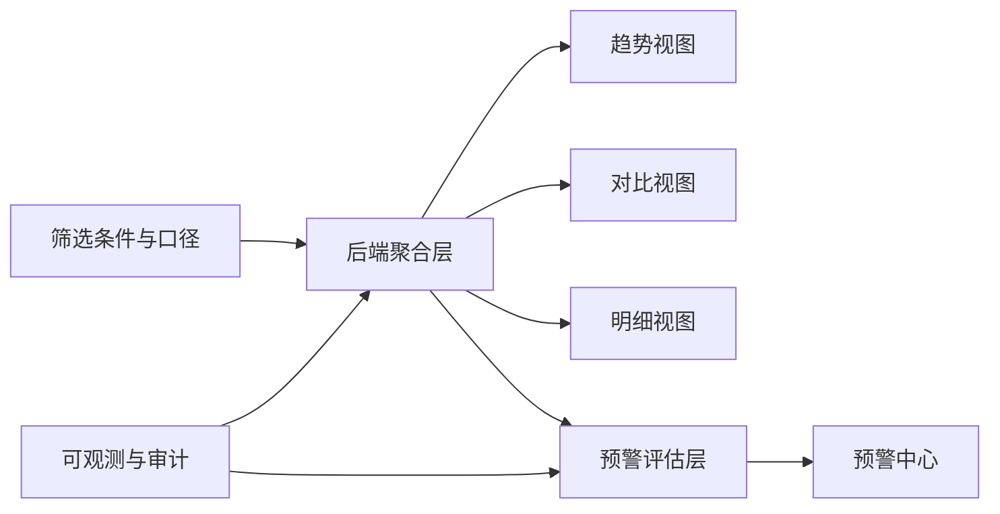

# A类行情整体升级改造方案

## 文档信息
| 字段 | 内容 |
|---|---|
| 文档名称 | A类行情整体升级改造方案 |
| 适用模块 | 商情中心 `A类行情分析` + `A类预警中心` |
| 版本 | v1.0 |
| 编写日期 | 2026-02-10 |
| 当前状态 | 设计评审稿 |
| 目标读者 | 产品、前端、后端、测试、运维 |

---

## 1. 项目背景

当前 A 类行情模块已具备多维筛选、趋势分析、对比分析、数据明细、连续性健康、预警等能力，但在以下方面存在明显升级空间：

| 类别 | 现状问题 | 业务影响 |
|---|---|---|
| 数据口径 | 审核态与来源口径未显式化 | 用户对结果可信度判断困难 |
| 枚举一致性 | 子类型存在历史值兼容问题（如站台价细分） | 筛选结果可能不完整或不一致 |
| 统计性能 | 前端承担大量本地统计，存在上限与偏差风险 | 数据量增长后性能下降与结果不稳定 |
| 交互复杂度 | 对比分析 TAB 控件过多，学习成本高 | 一线用户使用门槛高 |
| 预警行为 | 查询接口可触发重算，读写边界不清晰 | 结果可追踪性与可控性不足 |

---

## 2. 改造目标与非目标

## 2.1 改造目标
1. 建立统一、可解释、可切换的数据口径体系。  
2. 将高成本统计从前端迁移到后端聚合接口。  
3. 重构对比分析页面信息架构，默认简单、进阶可用。  
4. 明确预警“查询”与“评估”职责边界，提升系统可审计性。  
5. 提供可回归的测试标准与可观测指标，保证持续演进质量。  

## 2.2 非目标
1. 本阶段不重做整套商情中心视觉体系。  
2. 本阶段不引入新的外部 BI 平台。  
3. 本阶段不调整 B 类、C 类核心业务模型。  

---

## 3. 总体设计原则

1. 口径优先：先保证“算对”，再追求“看起来多”。  
2. 默认简洁：核心场景路径最短，高级能力折叠。  
3. 后端聚合：复杂统计下沉服务端，前端专注展示交互。  
4. 可追溯：每个结果都能回答“来源、公式、时间范围、过滤条件”。  
5. 兼容迁移：历史数据与历史参数可平滑过渡。  

---

## 4. 目标能力蓝图

---

## 5. 信息架构升级方案

## 5.1 页面结构（改造后）
| 区域 | 默认展示 | 高级模式 |
|---|---|---|
| 左侧筛选 | 品种、时间、采集点、区域、价格类型、口径 | 异常阈值、自定义窗口、实验参数 |
| 主内容 | 趋势分析、对比分析、数据明细 | 分布细节、基准对比增强、调试信息 |
| 顶部状态条 | 数据口径标签、样本量、更新时间、缺失率 | 指标解释抽屉 |

## 5.2 对比分析 TAB 分层
| 层级 | 功能 |
|---|---|
| 核心层（默认） | 综合排行、涨跌排行、区域均价对比 |
| 增强层（可展开） | 指数化、基准对比、分布图细节 |
| 专家层（权限或开关） | 调试指标、参数调优、诊断视图 |

---

## 6. 数据口径治理方案

## 6.1 口径开关设计
| 开关 | 可选值 | 默认值 | 说明 |
|---|---|---|---|
| 审核口径 | `APPROVED_ONLY` / `APPROVED_AND_PENDING` / `ALL` | `APPROVED_AND_PENDING` | 控制是否纳入待审数据 |
| 来源口径 | `AI_ONLY` / `MANUAL_ONLY` / `ALL` | `ALL` | 控制 AI 提取与人工填报混合方式 |
| 时间口径 | `自然日` / `交易日` | `自然日` | 影响缺失天数与覆盖率计算 |

## 6.2 子类型兼容策略
| 历史值 | 标准值 | 显示文案 |
|---|---|---|
| `STATION_ORIGIN` | `STATION` | 站台价 |
| `STATION_DEST` | `STATION` | 站台价 |

规则说明：
1. 查询入参先归一化再过滤。  
2. 落库前统一标准化，避免新增脏值。  
3. 前端筛选项去重后展示，避免用户看到语义重复。  

## 6.3 指标口径定义
| 指标 | 公式 |
|---|---|
| 日涨跌幅 | `dayChange / latestPrice * 100` |
| 区间涨幅 | `(lastPrice - firstPrice) / firstPrice * 100` |
| 波动率 | `(periodMax - periodMin) / periodAvg * 100` |
| 覆盖率 | `uniqueDays / expectedDays * 100` |
| 延迟率 | `lateCount / recordCount * 100` |
| 异常率 | `anomalyCount / recordCount * 100` |

---

## 7. 后端升级方案

## 7.1 API 分层重构
| API 类别 | 目标 |
|---|---|
| 明细查询 API | 用于表格浏览与下钻明细 |
| 聚合分析 API | 用于排行、分布、区域统计、质量概览 |
| 预警评估 API | 显式触发评估，不混入查询 |
| 预警查询 API | 只读查询，禁止隐式重算 |

## 7.2 新增/改造接口建议
| 方法 | 路径 | 作用 |
|---|---|---|
| `GET` | `/market-intel/price-analytics/ranking` | 返回综合排行与涨跌榜 |
| `GET` | `/market-intel/price-analytics/distribution` | 返回分布统计（箱线核心值） |
| `GET` | `/market-intel/price-analytics/regions` | 返回区域统计卡片数据 |
| `GET` | `/market-intel/price-analytics/quality-summary` | 返回样本、缺失、更新等质量概览 |
| `POST` | `/market-intel/alerts/evaluate` | 显式重算预警 |
| `GET` | `/market-intel/alerts` | 仅读取预警实例列表 |

## 7.3 查询参数标准化
| 参数 | 说明 |
|---|---|
| `commodity` | 品种 |
| `startDate` `endDate` | 时间窗口 |
| `collectionPointIds` | 采集点集合 |
| `regionCode` | 行政区划 |
| `pointTypes` | 点位类型 |
| `subTypes` | 价格子类型（自动兼容映射） |
| `reviewScope` | 审核口径 |
| `sourceScope` | 来源口径 |

## 7.4 性能设计
1. 聚合接口默认分页或限流。  
2. 关键查询建立组合索引与 explain 验证。  
3. 高频条件引入短时缓存（例如 60 秒）。  
4. 大窗口统计增加异步化兜底策略。  

---

## 8. 前端升级方案

## 8.1 状态模型
| 状态域 | 内容 |
|---|---|
| `filters` | 品种、时间、区域、点位、类型 |
| `scope` | 审核口径、来源口径 |
| `view` | 排序、分组、显示模式 |
| `ui` | 高级区展开状态、说明抽屉状态 |

## 8.2 组件拆分建议
| 新组件 | 责任 |
|---|---|
| `ScopeBar` | 数据口径展示与切换 |
| `ComparisonSummary` | 核心排行与涨跌榜 |
| `RegionInsightBoard` | 区域统计卡片 |
| `MetricHelpDrawer` | 指标公式与口径解释 |
| `AdvancedComparisonControls` | 高级参数集中管理 |

## 8.3 交互升级
1. 所有核心指标旁增加“口径说明”入口。  
2. 任何排行项可一键“下钻到明细 TAB”。  
3. 支持“保存当前视图”并快速复用。  
4. 高级能力默认折叠，减少首屏复杂度。  

---

## 9. 预警中心协同改造

| 项目 | 改造点 |
|---|---|
| 查询行为 | 列表查询默认不触发重算 |
| 重算行为 | 仅通过显式按钮触发 `evaluate` |
| 审计字段 | 记录评估触发人、触发时间、过滤条件 |
| 闭环策略 | 增加自动关闭规则与 `AUTO_CLOSE` 日志 |

---

## 10. 数据迁移与兼容方案

## 10.1 迁移原则
1. 先兼容后清理。  
2. 先读兼容再写规范。  
3. 灰度验证后再做存量修复。  

## 10.2 迁移步骤
| 步骤 | 动作 | 回滚策略 |
|---|---|---|
| 1 | 上线入参归一化与显示兼容 | 开关关闭归一化逻辑 |
| 2 | 新增聚合接口并双跑校验 | 前端回退旧接口 |
| 3 | 前端切换至聚合接口 | 回退 feature flag |
| 4 | 运行存量数据修复脚本 | 保留修复前快照 |

---

## 11. 测试策略

## 11.1 测试范围
| 维度 | 场景 |
|---|---|
| 功能正确性 | 筛选、排行、分组、下钻 |
| 口径一致性 | 明细与聚合结果一致 |
| 兼容性 | 历史子类型与新标准值一致 |
| 性能 | 大数据窗口响应时间 |
| 回归 | A类预警重算与状态流转 |

## 11.2 核心测试用例
1. 相同筛选条件下，前端聚合结果与数据库 SQL 校验结果一致。  
2. 使用 `STATION_ORIGIN/STATION_DEST` 查询时结果与 `STATION` 一致。  
3. `GET /alerts` 不带 `refresh=true` 时不写入预警实例与日志。  
4. 开启不同口径开关后，样本量与指标变动符合预期。  
5. 大数据量（例如 10 万行）下页面主视图可在目标时延内返回。  

---

## 12. 可观测与运维

## 12.1 指标体系
| 指标 | 目标 |
|---|---|
| 聚合接口 P95 时延 | <= 1200ms |
| 前端首屏可交互时间 | <= 2.5s |
| 预警评估耗时 | 可监控并趋势下降 |
| 统计偏差率 | 目标 0（以 SQL 校验为准） |

## 12.2 日志与审计
1. 记录每次聚合请求核心参数摘要。  
2. 记录每次预警评估触发来源。  
3. 记录口径开关选择，便于问题复盘。  

---

## 13. 分期实施计划（P0/P1/P2）

## 13.1 P0（正确性与边界）
| 编号 | 内容 | 状态 |
|---|---|---|
| P0-1 | 子类型兼容归一化（站台历史值） | 已执行 |
| P0-2 | 聚合接口替代前端本地统计 | 已执行 |
| P0-3 | 预警查询去副作用（默认不重算） | 已执行 |
| P0-4 | 增加口径开关（审核态/来源） | 已执行 |

## 13.2 P1（体验与性能）
| 编号 | 内容 |
|---|---|
| P1-1 | 采集点服务端搜索+分页 |
| P1-2 | 对比视图默认简化+高级区折叠 |
| P1-3 | 排行/区域一键下钻明细 |
| P1-4 | 预警自动关闭闭环 |

## 13.3 P2（工程化与扩展）
| 编号 | 内容 |
|---|---|
| P2-1 | 分析结果导出（聚合报表） |
| P2-2 | 保存视图模板与共享 |
| P2-3 | 指标中心与可视化可观测面板 |

---

## 14. 里程碑与人天预估

| 里程碑 | 主要产出 | 预计时长 |
|---|---|---|
| M1 | P0 全部完成，口径与边界稳定 | 1.5~2 周 |
| M2 | P1 完成，体验与性能达标 | 1~1.5 周 |
| M3 | P2 完成，形成长期可维护能力 | 1~2 周 |

---

## 15. 风险清单与应对

| 风险 | 说明 | 应对策略 |
|---|---|---|
| 聚合结果与明细不一致 | 口径实现偏差 | 建立 SQL 对账脚本，发布前全量比对 |
| 数据量突增导致接口抖动 | 聚合压力上升 | 加索引、限流、缓存、异步化兜底 |
| 用户不理解口径变化 | 指标认知偏差 | 页面显式展示口径标签与说明 |
| 改造影响存量功能 | 回归范围大 | 建立核心回归清单与灰度开关 |

---

## 16. 验收标准（Definition of Done）

1. 对比分析核心结果全部来源后端聚合接口。  
2. 关键指标均可点击查看公式和口径。  
3. 历史子类型筛选与展示无歧义。  
4. 预警查询不再产生隐式重算副作用。  
5. 通过约定回归集并输出对账报告。  
6. 达到性能目标并有监控看板可追踪。  

---

## 17. 任务拆解建议（便于进入开发迭代）

| 角色 | 第一批任务 |
|---|---|
| 产品 | 确认口径开关默认值与文案、确认对比 TAB 默认/高级分层 |
| 后端 | 建聚合 API、补充口径参数、优化索引、预警接口边界落地 |
| 前端 | 改造对比 TAB 结构、接入聚合 API、补下钻与说明抽屉 |
| 测试 | 建立口径对账用例、预警行为回归用例、性能基线用例 |
| 运维 | 增加关键指标监控与告警阈值 |

---

## 18. 附录：推荐实施顺序

1. 先完成 P0-2 与 P0-4，确保结果可信与可解释。  
2. 再做 P1-2 与 P1-3，降低用户复杂度并提升可用性。  
3. 最后推进 P2 能力，形成可复制的分析平台能力。  
