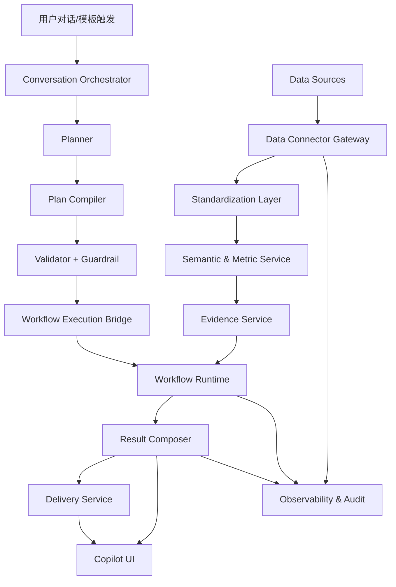
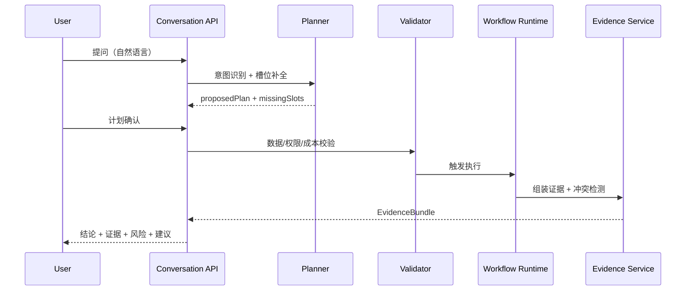
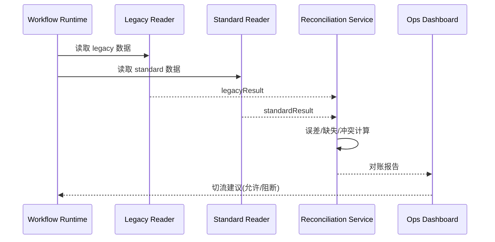

# CTBMS 大宗农产贸易超级智能体技术设计说明（TDD）v1.0

- 文档类型：技术设计说明（TDD）
- 对应 PRD：`docs/aiagnet-chat/CTBMS大宗农产贸易超级智能体-产品需求文档-PRD-v1.md`
- 对应数据字典：`docs/aiagnet-chat/CTBMS大宗农产贸易超级智能体-数据字典与指标口径-v1.md`
- 适用范围：`apps/api`、`apps/web`、`packages/types`

## 1. 设计目标

1. 打通多源数据到智能体工作流的端到端执行链路。
2. 对话和工作流共享同一数据语义、指标口径和证据结构。
3. 事实结论默认证据化输出，并具备冲突消解和置信度门禁。
4. 支持天气、物流等新 API 低成本接入与灰度发布。
5. 保障可观测、可审计、可回滚。

## 2. 总体架构



## 2.1 落地原则（避免重复建设）

1. 复用现有 `agent-conversations` 与 `workflow-execution` 主链，不新增平行会话域 Service。
2. 数据底座采用“双轨并行”：存量标准化改造与增量接入同步推进。
3. `/super-agent/*` 如需暴露，仅作为网关或 BFF 别名，后端落到同一业务实现。
4. 新功能默认消费标准层/指标层，禁止继续扩散对 legacy 源表的直接依赖。

## 3. 模块设计

## 3.1 Data Connector Gateway（扩展现有 DataConnector）

职责：

1. 统一外部/内部数据源接入协议。
2. 处理鉴权、限流、超时、重试、缓存、熔断。
3. 统一输出标准数据结构和采集元信息。

建议新增能力：

1. Connector Health API（健康状态、错误率、时延）。
2. Connector Policy（TTL、RateLimit、Fallback）。
3. Connector Test Sandbox（接入前连通性验证）。

## 3.2 Standardization Layer（标准化层）

职责：

1. 字段映射、单位/币种/时区转换。
2. 主数据归一（品类、区域、线路、合约）。
3. 质量标签写入（完整性/时效性/一致性/异常）。

输入：原始源数据。
输出：标准事实数据 + 质量元字段。

## 3.3 Semantic & Metric Service（语义与指标服务）

职责：

1. 维护指标字典与版本。
2. 提供指标计算 API 和工作流节点复用能力。
3. 支持指标分层（原子指标 -> 复合指标 -> 决策指标）。

建议首批内置：

1. 基差、波动率、库存天数。
2. 运价指数、天气扰动指数、运输摩擦指数。
3. 综合信号置信度。

## 3.4 Evidence Service（证据引擎）

职责：

1. 汇总事实结论所依赖的数据来源。
2. 生成 `EvidenceBundle` 结构用于前端展示与导出。
3. 执行冲突检测与仲裁。

核心产物：

```json
{
  "claim": "...",
  "evidence": [{ "source": "...", "time": "..." }],
  "conflicts": [],
  "confidence": 0.81
}
```

## 3.5 Conversation Orchestrator（复用并增强）

职责：

1. 意图识别、槽位补全、计划确认。
2. 对话执行桥接工作流。
3. 结果结构化输出（结论/证据/风险/建议）。

扩展点：

1. `PLAN_PREVIEW` 中显示成本与数据质量预估。
2. `RESULT_DELIVERY` 中支持订阅和回测触发。

## 3.6 Workflow Runtime（复用并增加门禁节点）

职责：

1. 编排执行数据查询、计算、分析、报告。
2. 支持条件分支、并发执行、失败重试。
3. 支持执行前/执行后门禁。

建议新增节点：

1. `data-readiness-gate`（数据时效/质量门禁）。
2. `evidence-assemble`（证据包组装）。
3. `conflict-resolve`（冲突检测与仲裁）。

## 3.7 Delivery & Subscription（交付与订阅）

职责：

1. 报告导出（Markdown/PDF/JSON）。
2. 多渠道投递（邮件、企微、钉钉等）。
3. 订阅调度、失败重试、补跑机制。

## 3.8 存量能力改造清单（Workflow/Agent/Rule/Parameter）

### A. Workflow（`workflow-definition` + `workflow-execution`）

1. 现有 `data-fetch/compute/risk-gate` 节点保留，统一增加标准层输入契约校验。
2. 在 preflight 增加口径一致性检查，拒绝 legacy 与 standard 混用的高风险模板。
3. 核心模板先双跑，再切换到标准层读取。

### B. Agent（`agent-profile` + `agent-prompt-template` + `agent-skill`）

1. 统一输出结构：结论、证据、风险、建议。
2. Prompt 与 Profile 增加证据必填约束，低置信度结论自动降级。
3. Skill 契约补齐 `input/output schema` 与副作用等级字段。

### C. Rule（`decision-rule`）

1. 将 `DecisionRulePack` 与标准层指标绑定，避免规则直接引用原始字段。
2. 统一规则执行入口，减少模板内硬编码阈值。
3. 规则结果输出可审计，并可回放到具体执行。

### D. Parameter（`parameter-center`）

1. 参数项增加指标口径版本关联（`metricVersion`）。
2. 参数发布走灰度与回滚流程，记录影响模板范围。
3. 参数快照必须随执行记录持久化，支持回放和差异分析。

## 3.9 标准化适配层与读模型设计（落地关键）

### 目标

1. 不中断现有采集写入链路。
2. 统一工作流与对话读取口径。
3. 控制冗余，避免“同一事实多份持久化”。

### 设计要点

1. `Adapter`：将 `PriceData/FuturesQuoteSnapshot/MarketIntel` 转换为标准 DTO。
2. `StandardReadModel`：提供统一查询接口（按品类/区域/时间）。
3. `ReconciliationService`：执行 legacy 与 standard 双跑对账。

建议接口（服务层）：

```ts
interface StandardizedMarketDataService {
  querySpot(params: SpotQuery): Promise<StandardSpotRecord[]>;
  queryFutures(params: FuturesQuery): Promise<StandardFuturesRecord[]>;
  queryEvent(params: EventQuery): Promise<StandardEventRecord[]>;
  reconcile(job: ReconcileJobRequest): Promise<ReconcileReport>;
}
```

## 4. 核心流程

## 4.1 对话触发执行流程



## 4.2 工作流模板执行流程

1. 用户选择模板并输入参数。
2. 系统执行 `data-readiness-gate`。
3. 运行数据获取与指标计算节点。
4. 组装证据并执行冲突仲裁。
5. 通过风控门禁后输出结果和交付动作。

## 4.3 订阅与回测流程

1. 从会话结果创建订阅计划。
2. 调度器按 cron 触发模板。
3. 执行完成后导出并投递。
4. 可选触发回测，生成策略评分并入报告。

## 4.4 双跑对账与切流流程



切流判定建议：

1. 关键指标误差连续 7 天低于阈值。
2. 核心模板执行成功率无回归。
3. 门禁告警率不高于基线。

## 5. 数据与存储设计

## 5.1 存储分层

1. Raw 层：保留原始数据包和源字段。
2. Standard 层：统一字段和维度编码。
3. Feature 层：沉淀业务特征和复合指标。
4. Decision 层：输出工作流和对话消费结果。

## 5.2 建议新增数据表（概要）

1. `WeatherObservation`
2. `LogisticsRouteSnapshot`
3. `MetricCatalog`
4. `MetricValueSnapshot`
5. `EvidenceBundle`
6. `DataQualityIssue`

完整草案见：`docs/aiagnet-chat/CTBMS大宗农产贸易超级智能体-数据表设计草案-PrismaDDL-v1.md`

## 5.3 存量改造迁移策略

1. 对 `PriceData/FuturesQuoteSnapshot/MarketIntel` 建立标准化适配器层，不直接改写原业务语义。
2. 执行双跑：同一任务同时产出 legacy 与 standard 结果，并按核心指标做对账。
3. 对账稳定后，将工作流模板切换到标准层读取；legacy 路径保留只读回放能力。
4. 新接入数据源必须先进入标准层，不允许绕过标准层直连工作流节点。

## 5.4 去冗余与写读策略

1. 写入策略：采集侧保持单主写入，不新增平行主事实表。
2. 读取策略：分析侧统一读标准层；legacy 仅用于回放和对账。
3. 缓存策略：以查询缓存替代重复落库，缓存失效由 TTL 控制。
4. 归档策略：legacy 历史数据按周期归档，不参与新模板默认读取。

## 6. 规则与门禁

## 6.1 执行前门禁

1. 权限校验：数据域和组织范围必须匹配。
2. 数据时效校验：核心指标超 TTL 则降级。
3. 质量校验：`qualityScore` 低于阈值阻断强结论。
4. 成本校验：超预算时自动调低执行深度。

## 6.2 执行后门禁

1. 引用门禁：事实句无证据不允许输出确定性结论。
2. 冲突门禁：冲突严重时只输出观察建议。
3. 风险门禁：高风险建议追加人工复核提示。

## 6.3 切流门禁（新增）

1. 对账门禁：`reconcile_pass_rate` 未达标时禁止切流。
2. 质量门禁：standard 输出 `qualityScore` 均值低于基线时禁止切流。
3. 稳定性门禁：新链路错误率高于 legacy 基线 20% 时自动回滚。
4. 可观测门禁：缺失 traceId 或关键日志字段时禁止发布。

## 7. 可观测与审计

## 7.1 可观测指标

1. Connector 可用率、时延、错误率。
2. 数据质量分布与冲突率。
3. 工作流成功率、重试率、超时率。
4. 对话响应时延、计划确认率、导出成功率。

## 7.2 审计链路

必须记录：

1. 谁发起了任务。
2. 使用了哪些数据源和版本。
3. 关键门禁判断结果。
4. 最终结论和投递对象。

## 8. 安全与合规

1. Connector 密钥统一由配置中心管理，不落库明文。
2. 敏感字段按角色脱敏展示。
3. 外部 API 请求遵循最小权限原则。
4. 导出和投递动作进入审计。

## 9. 灰度与发布策略

建议 Feature Flag：

1. `SUPER_AGENT_DATA_FOUNDATION_ENABLED`
2. `SUPER_AGENT_WEATHER_ENABLED`
3. `SUPER_AGENT_LOGISTICS_ENABLED`
4. `SUPER_AGENT_EVIDENCE_GATE_ENABLED`
5. `SUPER_AGENT_SUBSCRIPTION_ENABLED`

发布策略：

1. 先租户灰度，再角色灰度，最后全量。
2. 任一门禁指标异常可快速回滚（关闭开关）。

### 9.1 开关治理建议

| 开关                                  | 默认值  | 作用域 | 回滚动作                           |
| ------------------------------------- | ------- | ------ | ---------------------------------- |
| `SUPER_AGENT_DATA_FOUNDATION_ENABLED` | `false` | 租户   | 关闭后回退 legacy 读取             |
| `SUPER_AGENT_EVIDENCE_GATE_ENABLED`   | `false` | 角色   | 关闭后降级为软提示                 |
| `SUPER_AGENT_WEATHER_ENABLED`         | `false` | 模板   | 关闭后移除天气因子                 |
| `SUPER_AGENT_LOGISTICS_ENABLED`       | `false` | 模板   | 关闭后移除物流因子                 |
| `SUPER_AGENT_SUBSCRIPTION_ENABLED`    | `true`  | 全局   | 关闭后禁止新建订阅，保留已执行记录 |

## 10. 测试策略

1. 单元测试：指标计算、门禁规则、冲突仲裁。
2. 集成测试：Connector -> 标准化 -> 指标服务链路。
3. E2E 测试：对话执行、模板执行、订阅投递、回测。
4. 回归测试：现有工作流和对话链路不退化。

### 10.1 对账测试（必须）

1. 核心模板至少覆盖 3 类场景：周报、异动预警、天气物流评估。
2. 每次发布前执行对账快照，产出误差分布与异常样本。
3. 对账失败时阻断发布，并附带可复现输入输出样本。

## 11. 待技术决策项

1. 天气/物流数据缓存策略采用 Redis 还是数据库热表。
2. 指标计算实时化采用在线计算还是离线预聚合。
3. 证据包持久化粒度（按会话或按执行步骤）。
4. 冲突仲裁规则是否支持运营后台可配置。
