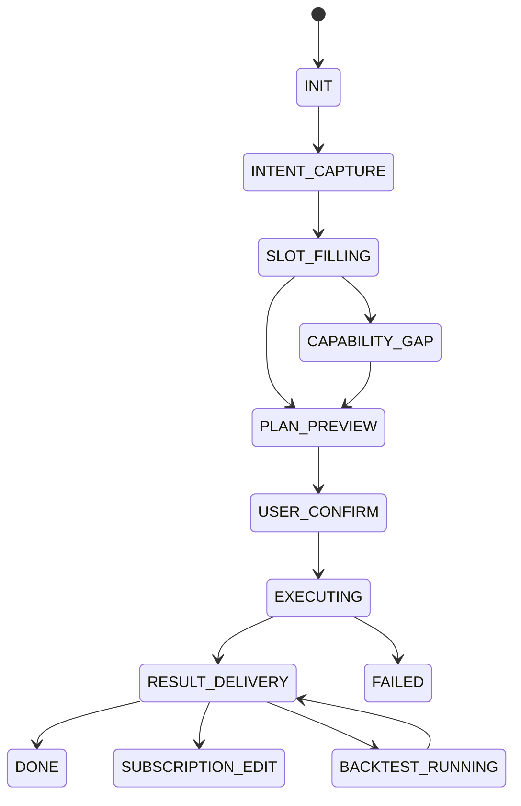

# CTBMS 对话式 AI Agent 前端状态流与页面结构 v1.1

- 适用应用：`apps/web`
- 建议入口路由：`/workflow/copilot`
- 设计原则：对话优先、结构可见、执行可控、交付闭环

## 1. 页面结构

## 1.1 三栏布局

1. 左栏：会话历史 + 场景快捷入口
2. 中栏：对话区（消息流 + 输入框 + 执行状态）
3. 右栏：结构化面板（计划、参数、引用、交付）

## 1.2 子页面/抽屉

1. 辩论配置抽屉（参与者、回合、裁判策略）
2. 导出与交付抽屉（格式、标题、收件人）
3. Capability Gap 抽屉（技能缺口说明 + 草稿创建）
4. 订阅配置抽屉（周期、时区、静默时段、投递目标）
5. 回测配置抽屉（回看区间、费用模型、策略来源）
6. 冲突解释抽屉（冲突项、来源优先级、采用依据）

## 2. 前端状态流



## 3. 关键页面交互

## 3.1 对话输入区

1. 支持普通输入与“辩论模式”快捷词识别。
2. 回车发送，Shift+Enter 换行。
3. 显示当前会话状态标签（如“补槽中”“待确认”“执行中”）。

## 3.2 计划预览区（右栏）

展示字段：

1. `planType`（RUN_PLAN / DEBATE_PLAN）
2. 数据源清单（价格、知识库、期货、持仓）
3. 技能清单（含估算耗时与成本）
4. 输出格式（JSON/Markdown/PDF/Word）
5. 风险提示（低置信度、数据缺失、权限限制）
6. 冲突提示（来源冲突数、一致性评分）

操作按钮：

1. `确认执行`
2. `继续修改`
3. `切换专家模式`

## 3.3 执行与结果区

1. 执行过程展示阶段进度：
   - 计划校验
   - 工作流触发
   - 数据汇聚
   - 结果生成
   - 导出交付
2. 结果展示采用分区卡：
   - 事实（带引用）
   - 分析
   - 建议与风险
3. 附件区：下载链接与邮件状态。
4. 拓展区：一键“创建订阅”、一键“发起回测”。

## 4. 辩论模式 UI 细节

1. 参与者列表卡（可编辑角色、权重、agentCode）。
2. 裁判策略切换（WEIGHTED / MAJORITY / JUDGE_AGENT）。
3. 辩论回合时间线（轮次、关键论点、共识度）。
4. 裁判结论卡（action、confidence、dissent）。

## 5. 交付 UI 细节

1. 导出格式选择：PDF/Word/JSON。
2. 报告段落选择：结论、证据、辩论过程、风险评估。
3. 邮件投递：收件人、主题、正文。
4. 投递状态：QUEUED/SENDING/SENT/FAILED。

## 6. 订阅与回测 UI 细节

1. 订阅卡片字段：名称、cron、状态、下次执行时间。
2. 订阅快捷操作：暂停、恢复、立即执行、编辑。
3. 回测卡片字段：收益率、最大回撤、胜率、综合评分。
4. 回测结果视图：曲线图 + 假设参数 + 风险声明。
5. 冲突提示条：一致性分、冲突数、查看详情入口。

## 7. 前端数据模型（建议）

```ts
type CopilotSessionState =
  | 'INTENT_CAPTURE'
  | 'SLOT_FILLING'
  | 'PLAN_PREVIEW'
  | 'USER_CONFIRM'
  | 'EXECUTING'
  | 'RESULT_DELIVERY'
  | 'DONE'
  | 'FAILED'

interface CopilotMessage {
  id: string
  role: 'user' | 'assistant' | 'system'
  content: string
  structuredPayload?: Record<string, unknown>
  createdAt: string
}

interface CopilotPlanView {
  planId: string
  planType: 'RUN_PLAN' | 'DEBATE_PLAN'
  skills: string[]
  dataSources: string[]
  paramSnapshot: Record<string, unknown>
  estimatedCost?: { token?: number; latencyMs?: number }
  risks?: string[]
  conflicts?: { topic: string; score: number }[]
}

interface CopilotSubscription {
  id: string
  name: string
  cronExpr: string
  timezone: string
  status: 'ACTIVE' | 'PAUSED' | 'FAILED' | 'ARCHIVED'
  nextRunAt?: string
}

interface CopilotBacktestSummary {
  backtestJobId: string
  status: 'QUEUED' | 'RUNNING' | 'COMPLETED' | 'FAILED'
  returnPct?: number
  maxDrawdownPct?: number
  winRatePct?: number
  score?: number
}
```

## 8. React Query 建议

1. `useCreateConversationSession`
2. `useConversationTurns`
3. `useSendConversationTurn`
4. `useConfirmConversationPlan`
5. `useConversationResult`
6. `useStartDebatePlan`
7. `useExportConversationReport`
8. `useDeliverConversationEmail`
9. `useCreateSkillDraft`
10. `useCreateSubscription`
11. `useUpdateSubscription`
12. `useCreateBacktest`
13. `useBacktestResult`
14. `useConversationConflicts`

## 9. 错误态设计

1. 数据源不可用：显示降级提示 + 一键重试。
2. 权限不足：显示需要授权的数据域。
3. 导出失败：保留原始结果并允许重新导出。
4. 邮件失败：提供复制下载链接与重发操作。
5. 订阅失败：展示失败原因并支持一键补跑。
6. 回测失败：提示数据不足或参数不合法并给推荐修复项。

## 10. MVP 组件清单

1. `CopilotPage`
2. `SessionSidebar`
3. `ChatTimeline`
4. `PlanPreviewPanel`
5. `DebateConfigDrawer`
6. `ResultSections`
7. `DeliveryPanel`
8. `CapabilityGapPanel`
9. `SubscriptionPanel`
10. `BacktestPanel`
11. `ConflictInsightDrawer`

## 11. 前端落地步骤

1. 先完成会话与计划确认主链路。
2. 再接辩论配置与回合结果展示。
3. 最后接入导出/邮件与 Skill Draft 面板。
4. 增补订阅中心、回测卡片与冲突解释面板。
