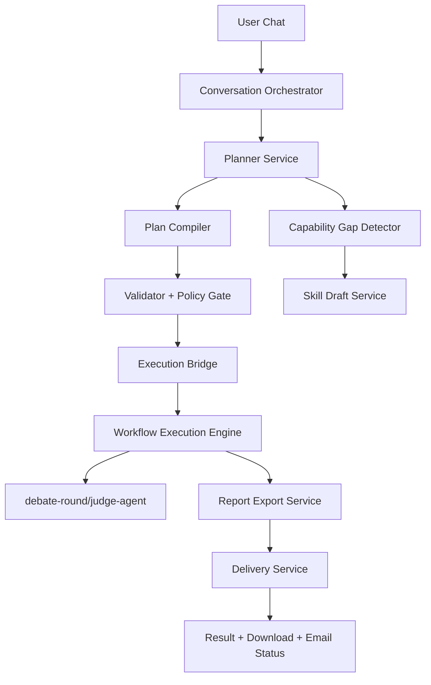
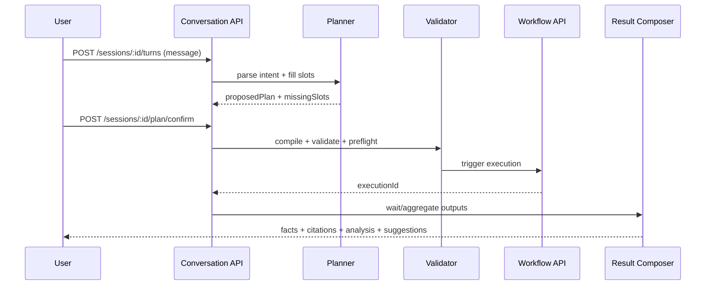

# CTBMS 对话式 AI Agent 技术设计说明（TDD）v1.1

- 文档类型：技术设计说明（TDD）
- 对应 PRD：`docs/aiagnet-chat/CTBMS对话式AI智能体-产品需求文档-PRD-v1.md`
- 适用范围：`apps/api`、`apps/web`、`packages/types`

## 1. 设计目标

1. 将“对话请求”稳定映射为“可执行计划”。
2. 复用既有工作流执行链路（validate/preflight/trigger）。
3. 支持多智能体辩论链路（debate-round + judge-agent）。
4. 支持交付链路（报告导出 + 邮件发送）。
5. 支持能力缺口识别与 Skill Draft 受控流程。
6. 支持订阅式调度执行与自动交付。
7. 支持建议回测与结果评分。
8. 支持多源数据冲突检测与消解策略。

## 2. 架构总览



## 3. 模块拆分（API）

### 3.1 新增模块

1. `agent-conversation`
   - 会话生命周期
   - 多轮状态机
   - 槽位管理
2. `agent-planner`
   - 意图识别
   - `RunPlan` / `DebatePlan` 生成
   - 计划修复
3. `agent-delivery`
   - 交付动作编排（导出、邮箱发送）
4. `agent-skill-draft`
   - 能力缺口记录
   - Skill Draft 生成、测试、提交审批
5. `agent-subscription`
   - 订阅计划管理（cron、静默期、执行策略）
   - 周期任务调度与重试
6. `agent-backtest`
   - 建议转换为回测任务
   - 回测指标计算（收益、回撤、胜率）
7. `agent-conflict-resolver`
   - 来源一致性分析
   - 冲突归并与解释生成

### 3.2 复用模块

1. `workflow-definition`（validate/preflight）
2. `workflow-execution`（trigger + node executors）
3. `report-export`（PDF/Word/JSON 导出）
4. `agent-skill`（registry + handlers）
5. `futures-sim`、`knowledge`、`market-intel`

## 4. 核心流程设计

## 4.1 标准分析流程



## 4.2 辩论流程

1. Planner 识别 `taskMode=DEBATE`。
2. 编译 `DebatePlan`：
   - 参与者角色
   - 回合数
   - 裁判策略（WEIGHTED/MAJORITY/JUDGE_AGENT）
3. 执行链路：
   - `debate-round` 节点
   - `judge-agent` 节点
4. 汇总结论后调用 `report-export` 生成 PDF。
5. 如用户指定邮箱，进入 Delivery 流程。

## 4.3 交付流程

1. 创建导出任务：`POST /report-exports`。
2. 轮询导出状态或回调。
3. 文件可下载：`GET /report-exports/:id/download`。
4. 邮件发送任务：`POST /agent-conversations/:id/deliver/email`。

## 4.4 Skill Draft 流程

1. Planner 或 Validator 触发 `CapabilityGap`。
2. 创建 `SkillDraft`（接口定义+伪实现模板）。
3. 沙箱测试并产出 `SkillDraftTestRun`。
4. 审批通过后写入正式 `AgentSkill`。

## 4.5 订阅流程

1. 从已确认 `ConversationPlan` 创建订阅。
2. 订阅管理器写入 cron 任务并绑定执行模板。
3. 调度触发后调用既有执行链路。
4. 产出结果后自动执行导出与投递。
5. 失败任务进入重试队列，超过上限标记 FAILED。

## 4.6 回测流程

1. 从结果中的 `actions` 提取回测信号。
2. 读取历史价格、持仓与费用参数。
3. 计算核心指标：累计收益、最大回撤、胜率、夏普（可选）。
4. 生成回测报告并回写会话结果。

## 4.7 冲突消解流程

1. 聚合多个来源事实条目。
2. 按来源优先级、数据新鲜度、可信分进行冲突比对。
3. 生成冲突记录与采用决策。
4. 低一致性时下调 `confidence` 并触发建议降级。

## 5. 对话状态机

```text
INIT -> INTENT_CAPTURE -> SLOT_FILLING -> PLAN_PREVIEW -> USER_CONFIRM
-> EXECUTING -> RESULT_DELIVERY -> (DONE)
                           \-> CAPABILITY_GAP -> DRAFT_CREATED
```

状态约束：

1. `PLAN_PREVIEW` 前不得执行。
2. `USER_CONFIRM` 必须绑定 planVersion。
3. `EXECUTING` 期间拒绝并发 confirm。

## 6. 数据与模型策略

1. 事实输出统一三段：`facts`、`analysis`、`actions`。
2. `facts[]` 必须含 `citations[]`。
3. 建议类输出必须带 `riskDisclosure`。
4. 输出支持 `JSON + Markdown + PDF/Word`。
5. `actions` 可选附带 `backtestSummary`。
6. `facts` 可选附带 `conflictSummary`。

## 7. 治理与门禁

1. 权限门禁：数据域权限不满足则阻断。
2. 引用门禁：事实无证据则降级为“待确认”。
3. 置信度门禁：低于阈值禁止输出 BUY/SELL。
4. 成本门禁：预算超限自动降级（减少轮次或缩短窗口）。
5. 审计：会话、计划、执行、导出、投递全链路留痕。
6. 订阅门禁：限制最小频率、静默窗口、日发送上限。
7. 回测门禁：必须包含费用模型与假设说明。

## 8. 异常与降级策略

1. 数据源超时：使用缓存数据并标注时间戳。
2. 期货源不可用：降级为现货+知识库分析。
3. 辩论角色不足：回退单 Agent 分析模板。
4. 邮件发送失败：保留下载链接并返回失败原因。
5. 订阅执行失败：自动重试 + 失败告警 + 支持手动补跑。
6. 回测数据不足：回退至“不可回测”说明，保留建议但降级置信度。
7. 多源冲突严重：输出冲突摘要并提示人工复核。

## 9. 发布与回滚

1. 新增功能默认走 feature flag：`AGENT_COPILOT_ENABLED`。
2. 辩论与邮件分开开关：`AGENT_DEBATE_ENABLED`、`AGENT_DELIVERY_EMAIL_ENABLED`。
3. 订阅、回测、冲突消解开关：`AGENT_SUBSCRIPTION_ENABLED`、`AGENT_BACKTEST_ENABLED`、`AGENT_CONFLICT_RESOLVER_ENABLED`。
4. 回滚策略：关闭开关，不影响现有 workflow 页面。

## 10. 开发分期建议

1. Phase 1：会话 + Planner + RunPlan 执行闭环。
2. Phase 2：DebatePlan + 导出联动。
3. Phase 3：邮件交付 + Skill Draft。
4. Phase 4：订阅中心 + 回测引擎 + 冲突消解。
