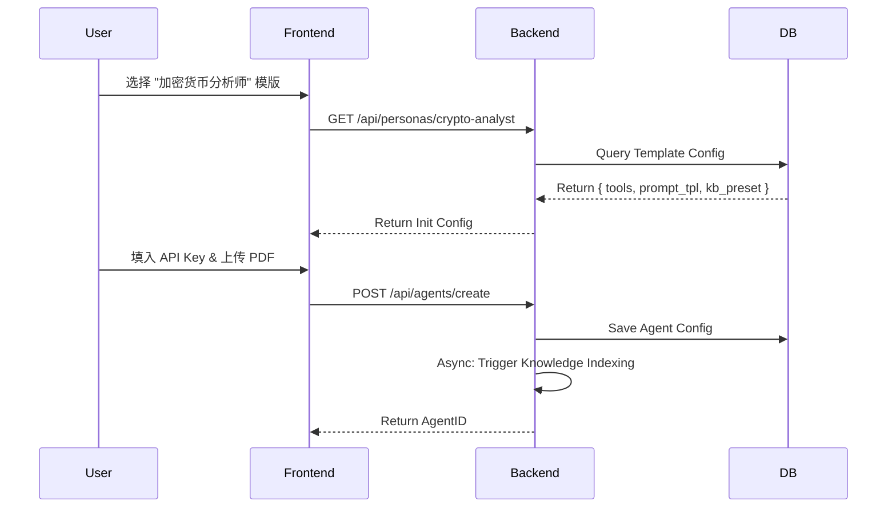

# 01. 产品架构与核心理念：智能体配置的“降维打击”

> **版本**: 1.1 (技术细化版)
> **状态**: 待开发
> **核心受众**: 架构师, 核心开发, QA
> **变更**: 新增系统分层架构图、模块交互时序图、核心技术栈选型

---

## 1. 核心痛点与产品愿景 (Business Context)

### 1.1 现状分析
当前 Agent 配置的三大门槛：
1.  **连接门槛**：API 鉴权复杂，WebSocket/gRPC 协议异构。
2.  **数据门槛**：非结构化文档处理（PDF/表格）效果差，缺乏工程化切片。
3.  **认知门槛**：Prompt 编写缺乏范式，CoT (思维链) 难以落地。

### 1.2 产品愿景：Configuration by Convention
- **预设优先**：系统内置最佳实践的 RAG 参数、API 连接器。
- **角色化封装**：通过 "Persona" 聚合底层能力，用户仅需 "Select & Fill"。

---

## 2. 系统分层架构 (Technical Architecture)

```mermaid
graph TD
    subgraph "Client Layer (Next.js)"
        UI_Wizard[配置向导 (Wizard)]
        UI_Sandbox[调试沙箱 (Sandbox)]
        UI_Visual[可视化反馈 (Trace View)]
    end

    subgraph "Glue Layer (NestJS)"
        API_Gateway[API Gateway]
        
        subgraph "Orchestration Engine"
            Mgr_Persona[Persona Manager]
            Mgr_Prompt[Prompt Factory]
            Mgr_Connector[Connector Hub]
        end
        
        subgraph "Data Pipeline"
            Worker_ETL[ETL Worker]
            Worker_Crawler[Crawler Worker]
        end
    end

    subgraph "Kernel Layer"
        LLM_Router[Model Router (LiteLLM)]
        Vec_DB[(Vector DB - Milvus)]
        Redis_Cache[(Redis - Realtime Data)]
        Main_DB[(Postgres - Configs)]
    end

    UI_Wizard --> API_Gateway
    API_Gateway --> Mgr_Persona
    Mgr_Persona --> Mgr_Prompt
    Mgr_Persona --> Mgr_Connector
    
    Mgr_Connector -- Fetch/Clean --> Worker_ETL
    Worker_ETL -- Indexing --> Vec_DB
```

---

## 3. 核心模块技术规格 (Module Specs)

### 3.1 交互层 (Interaction Layer)
*   **技术栈**: React 18, Ant Design Pro, React Flow (可视化编排)。
*   **关键组件**:
    *   `PersonaSelector`: 卡片式选择器，支持根据标签过滤。
    *   `ConfigWizard`: 状态机驱动的分步向导 (`xstate`)。
    *   `LiveTrace`: 基于 Server-Sent Events (SSE) 的实时思维链展示。

### 3.2 胶水层 (Glue Layer)
*   **技术栈**: NestJS, BullMQ (任务队列), LangChain/LangGraph (逻辑编排)。
*   **核心服务**:
    *   `ConnectorService`: 动态加载 YAML 定义的连接器，执行 HTTP/WS 请求。
    *   `PromptService`: 基于 Jinja2 模版引擎渲染最终 Prompt。
    *   `KnowledgeService`: 管理非结构化文档的上传、解析状态流转。

### 3.3 引擎层 (Engine Layer)
*   **Vector DB**: **Milvus** (生产环境) 或 **PGVector** (开发环境)。
*   **Model Gateway**: 使用 **LiteLLM** 或自建 Proxy 统一封装 OpenAI/Anthropic/DeepSeek 接口。

---

## 4. 关键业务流程时序 (Sequence Diagrams)

### 4.1 角色初始化流程 (Persona Initialization)



---

## 5. 开发与测试验收标准 (Acceptance Criteria)

### 5.1 开发规范
*   **Schema First**: 所有连接器定义、Agent 配置必须优先定义 Zod Schema。
*   **Error Handling**: 所有 API 调用失败必须返回标准错误码 (e.g., `E_AUTH_FAILED`, `E_RATE_LIMIT`)，前端据此显示友好提示。

### 5.2 测试重点
*   **连接器兼容性**: 验证内置连接器在 API Key 失效、网络超时下的降级表现。
*   **RAG 准确性**: 上传标准财报 PDF，验证能否准确提取 "净利润" 字段 (F1 Score > 0.8)。
*   **并发性能**: 支持 50+ Agent 同时进行知识库索引 (BullMQ 并发控制)。
