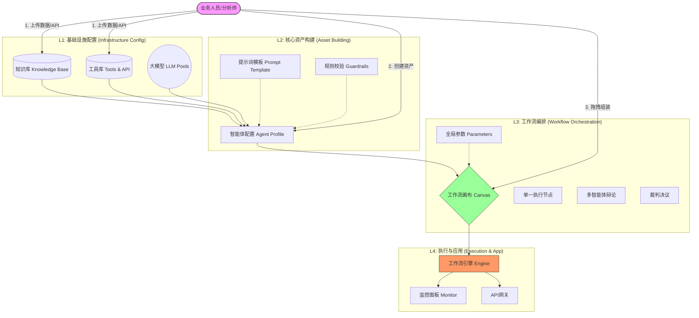
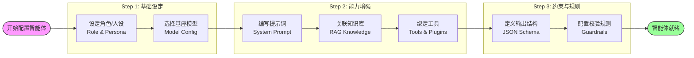
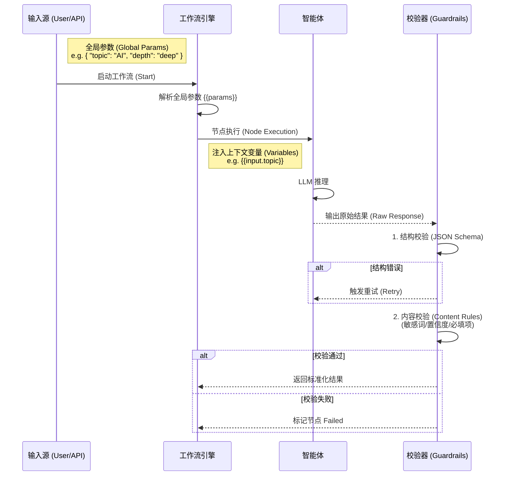
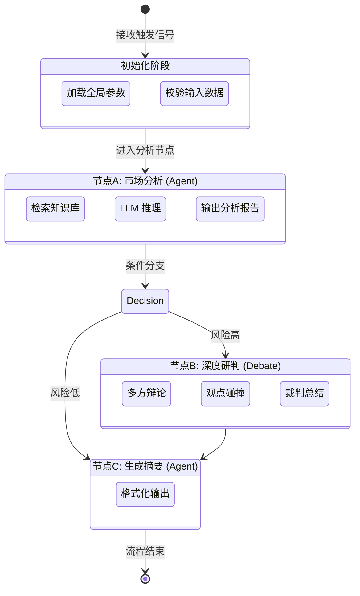

# 智能体工作流全景图解 (Comprehensive Agent Workflow Diagrams)

## 1. 宏观架构: 智能体工作流生态 (Macro Architecture)

---

## 2. 子流程: 智能体能力配置 (Micro: Agent Capability Config)

此图展示了如何构建一个具备特定能力（知识、工具、规则）的单一智能体。

---

## 3. 子流程: 规则与参数配置 (Micro: Rules & Parameters)

此图展示了在工作流中流转的数据（参数）和保障质量的规则（Guardrails）是如何生效的。

---

## 4. 核心流程: 工作流编排与执行 (Workflow Orchestration & Execution)

此图展示了多个智能体如何串联协作，完成复杂任务。

