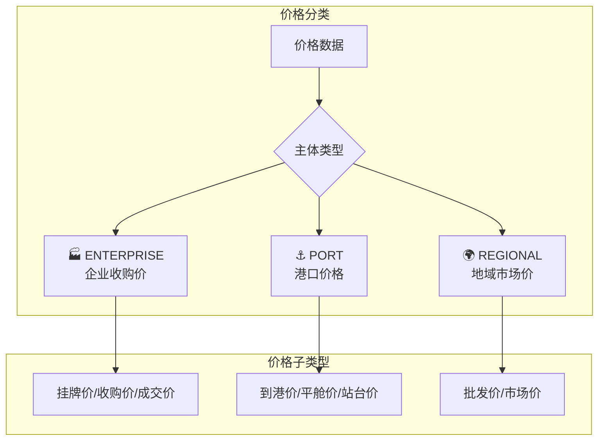

# 价格分类存储方案 - Walkthrough

> **完成日期**: 2026-01-19
> **核心改动**: 实现企业价格 vs 地域价格 vs 港口价格的分类存储

---

## 📋 变更概览

本次更新实现了价格数据的三维度分类存储：



---

## 📁 修改文件

### 1. 数据库 Schema

#### [schema.prisma](file:///Users/mac/Progame/CTBMS/apps/api/prisma/schema.prisma)

新增 3 个枚举和多个字段：

**新增枚举**：

| 枚举 | 值 | 用途 |
| :--- | :--- | :--- |
| `PriceSourceType` | ENTERPRISE / REGIONAL / PORT | 价格主体类型 |
| `PriceSubType` | LISTED / TRANSACTION / ARRIVAL / FOB / STATION_ORIGIN / STATION_DEST / PURCHASE / WHOLESALE / OTHER | 价格子类型 |
| `GeoLevel` | COUNTRY / REGION / PROVINCE / CITY / DISTRICT / PORT / STATION / ENTERPRISE | 地理层级 |

**PriceData 表新增字段**：

| 字段 | 类型 | 说明 |
| :--- | :--- | :--- |
| `sourceType` | PriceSourceType | 价格主体类型 |
| `subType` | PriceSubType | 价格子类型 |
| `geoLevel` | GeoLevel | 地理层级 |
| `enterpriseId` | String? | 关联的企业ID（企业价格） |
| `enterpriseName` | String? | 企业名称（冗余存储） |
| `province` | String? | 省份 |
| `city` | String? | 城市 |
| `district` | String? | 区县 |
| `longitude` | Float? | 经度（地图展示） |
| `latitude` | Float? | 纬度（地图展示） |
| `note` | String? | 附加说明 |

render_diffs(file:///Users/mac/Progame/CTBMS/apps/api/prisma/schema.prisma)

---

### 2. 类型定义

#### [market-intel.ts](file:///Users/mac/Progame/CTBMS/packages/types/src/modules/market-intel.ts)

新增枚举和标签映射：

```typescript
// 价格主体类型
enum PriceSourceType {
  ENTERPRISE = 'ENTERPRISE',  // 企业收购价
  REGIONAL = 'REGIONAL',      // 地域市场价
  PORT = 'PORT',              // 港口价格
}

// 价格子类型
enum PriceSubType {
  LISTED = 'LISTED',                  // 挂牌价
  TRANSACTION = 'TRANSACTION',        // 成交价
  ARRIVAL = 'ARRIVAL',                // 到港价
  FOB = 'FOB',                        // 平舱价
  STATION_ORIGIN = 'STATION_ORIGIN',  // 站台价-产区
  STATION_DEST = 'STATION_DEST',      // 站台价-销区
  PURCHASE = 'PURCHASE',              // 收购价
  WHOLESALE = 'WHOLESALE',            // 批发价
  OTHER = 'OTHER',                    // 其他
}
```

render_diffs(file:///Users/mac/Progame/CTBMS/packages/types/src/modules/market-intel.ts)

---

### 3. AI 识别逻辑

#### [ai.service.ts](file:///Users/mac/Progame/CTBMS/apps/api/src/modules/ai/ai.service.ts)

新增企业、港口、地域关键词库和 `classifyPricePoint()` 方法：

**企业关键词**：
```
梅花味精、益海嘉里、中粮生化、象屿生化、吉林燃料乙醇、长春大成...
```

**港口关键词**：
```
锦州港、鲅鱼圈、北良港、大连港、营口港、天津港、青岛港...
```

**自动识别逻辑**：
1. 匹配企业名称 → `ENTERPRISE`
2. 匹配港口名称 → `PORT`
3. 其他 → `REGIONAL`

**价格子类型识别**：
- 包含"平舱" → `FOB`
- 包含"到港" → `ARRIVAL`
- 包含"站台" → `STATION_ORIGIN` / `STATION_DEST`
- 包含"成交" → `TRANSACTION`
- 包含"收购" → `PURCHASE`

render_diffs(file:///Users/mac/Progame/CTBMS/apps/api/src/modules/ai/ai.service.ts)

---

### 4. 数据写入逻辑

#### [market-intel.service.ts](file:///Users/mac/Progame/CTBMS/apps/api/src/modules/market-intel/market-intel.service.ts)

`batchCreatePriceData()` 方法更新：

- 支持新的价格分类字段
- 自动尝试匹配系统中的企业
- 更新唯一约束以包含 `sourceType` 和 `subType`

render_diffs(file:///Users/mac/Progame/CTBMS/apps/api/src/modules/market-intel/market-intel.service.ts)

---

### 5. 前端展示

#### [DataEntry.tsx](file:///Users/mac/Progame/CTBMS/apps/web/src/features/market-intel/components/DataEntry.tsx)

价格数据按类型分组展示：

```
┌─────────────────────────────────────────────────────────────┐
│ 📊 提取的价格数据 (A类)                           [5条]     │
├─────────────────────────────────────────────────────────────┤
│ 🏭 企业收购价                                    [2条]      │
│   梅花味精 [挂牌价]    2750 元/吨  →                        │
│   益海嘉里 [收购价]    2720 元/吨  ↑5                       │
├─────────────────────────────────────────────────────────────┤
│ ⚓ 港口价格                                      [2条]      │
│   锦州港 [平舱价]      2680 元/吨  ↓10                      │
│   鲅鱼圈 [到港价]      2675 元/吨  ↓8                       │
├─────────────────────────────────────────────────────────────┤
│ 🌍 地域市场价                                    [1条]      │
│   东北 [市场价]        2650 元/吨  →                        │
└─────────────────────────────────────────────────────────────┘
```

render_diffs(file:///Users/mac/Progame/CTBMS/apps/web/src/features/market-intel/components/DataEntry.tsx)

---

## 🗃️ 数据库迁移

迁移文件：`20260119020703_add_price_classification`

```sql
-- 新增枚举
CREATE TYPE "PriceSourceType" AS ENUM ('ENTERPRISE', 'REGIONAL', 'PORT');
CREATE TYPE "PriceSubType" AS ENUM ('LISTED', 'TRANSACTION', ...);
CREATE TYPE "GeoLevel" AS ENUM ('COUNTRY', 'REGION', ...);

-- 修改表结构
ALTER TABLE "PriceData" ADD COLUMN "sourceType" "PriceSourceType" DEFAULT 'REGIONAL';
ALTER TABLE "PriceData" ADD COLUMN "subType" "PriceSubType" DEFAULT 'LISTED';
ALTER TABLE "PriceData" ADD COLUMN "geoLevel" "GeoLevel" DEFAULT 'CITY';
ALTER TABLE "PriceData" ADD COLUMN "enterpriseId" TEXT;
...
```

---

## ✅ 验证结果

| 项目 | 状态 |
| :--- | :---: |
| Prisma 迁移 | ✅ |
| `packages/types` 编译 | ✅ |
| `apps/api` 编译 | ✅ |
| `apps/web` 编译 | ✅ |

---

## 🎯 使用示例

### 日报输入示例

```
【东北玉米市场日报】2026年1月19日

一、企业收购价
- 梅花味精挂牌价：2750元/吨（持平）
- 益海嘉里收购价：2720元/吨（↑5）

二、港口价格
- 锦州港平舱价：2680元/吨（↓10）
- 鲅鱼圈到港价：2675元/吨（↓8）

三、市场心态
贸易商观望情绪浓厚...
```

### AI 解析结果

系统会自动识别并分类：

| 地点 | 价格 | 类型 | 子类型 |
| :--- | :--- | :--- | :--- |
| 梅花味精 | 2750 | ENTERPRISE | LISTED |
| 益海嘉里 | 2720 | ENTERPRISE | PURCHASE |
| 锦州港 | 2680 | PORT | FOB |
| 鲅鱼圈 | 2675 | PORT | ARRIVAL |

---

## 🔮 后续迭代建议

1. **地图价格展示**
   - 利用 `longitude`/`latitude` 在地图上标注价格点
   
2. **企业价格趋势图**
   - 按企业维度展示历史价格走势

3. **港口价格监控**
   - 专门的港口价格 Dashboard

4. **价格预警**
   - 当某企业/港口价格异常波动时自动告警

---

*Walkthrough 生成时间: 2026-01-19*
