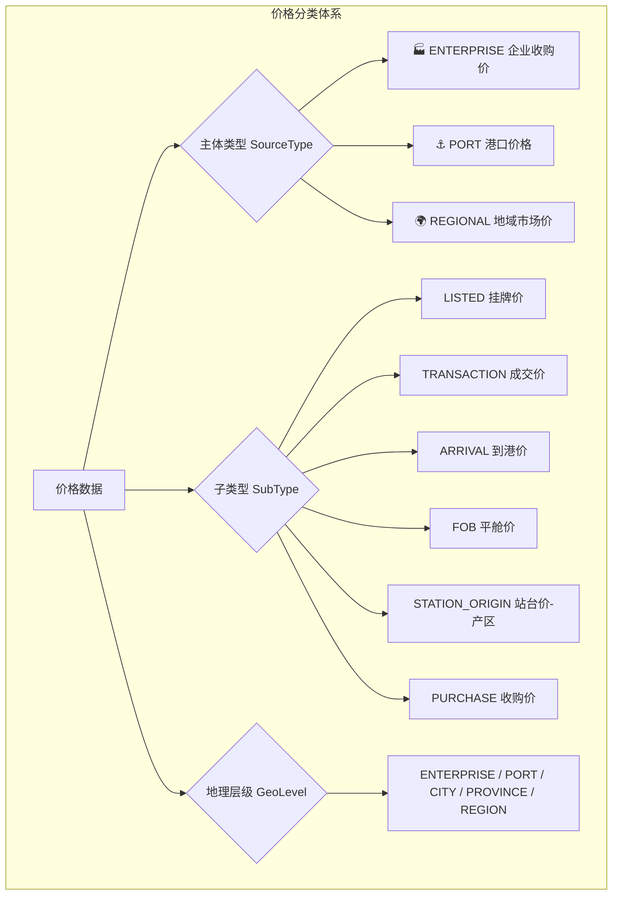

# 价格分类存储方案 - Walkthrough

> **完成日期**: 2026-01-19
> **最后更新**: 2026-01-22
> **核心改动**: 实现企业价格 vs 地域价格 vs 港口价格的三维分类存储

---

## 📋 变更概览

本次更新实现了价格数据的三维度分类存储，配合采集点配置和行政区划，形成完整的价格数据管理体系。



---

## 🗃️ 数据库模型

### PriceData 表结构

| 字段 | 类型 | 说明 |
| :--- | :--- | :--- |
| `sourceType` | PriceSourceType | 价格主体类型 |
| `subType` | PriceSubType | 价格子类型 |
| `geoLevel` | GeoLevel | 地理层级 |
| `location` | String | 采集点名称 |
| `collectionPointId` | String? | 关联采集点配置 |
| `regionCode` | String? | 关联行政区划 |
| `enterpriseId` | String? | 关联企业（企业价格） |
| `effectiveDate` | Date | 价格日期 |
| `commodity` | String | 品种 |
| `price` | Decimal | 价格（元/吨） |
| `dayChange` | Decimal? | 较昨日涨跌 |

### 枚举定义

#### PriceSourceType

| 值 | 说明 |
| :--- | :--- |
| `ENTERPRISE` | 企业收购价（具体企业的挂牌/成交价） |
| `REGIONAL` | 地域市场价（区域综合价格） |
| `PORT` | 港口价格（到港/平舱价） |

#### PriceSubType

| 值 | 说明 |
| :--- | :--- |
| `LISTED` | 挂牌价（企业对外公布） |
| `TRANSACTION` | 成交价（实际成交） |
| `ARRIVAL` | 到港价（到达港口的价格） |
| `FOB` | 平舱价（船舱交货价） |
| `STATION_ORIGIN` | 站台价-产区（东北站台发货价） |
| `STATION_DEST` | 站台价-销区（销区站台到货价） |
| `PURCHASE` | 收购价（向农户/贸易商收购） |
| `WHOLESALE` | 批发价（批发市场价格） |

#### GeoLevel

| 值 | 说明 |
| :--- | :--- |
| `COUNTRY` | 国家级 |
| `REGION` | 大区（东北/华北等） |
| `PROVINCE` | 省级 |
| `CITY` | 市级 |
| `DISTRICT` | 区县级 |
| `PORT` | 港口 |
| `STATION` | 站台 |
| `ENTERPRISE` | 企业点位 |

---

## ⚙️ 采集点配置

### CollectionPoint 表

支持采集点的统一配置管理：

| 字段 | 说明 |
| :--- | :--- |
| `code` | 唯一编码（如 JINZHOU_PORT） |
| `name` | 显示名称 |
| `aliases` | 别名列表（AI 模糊匹配） |
| `type` | ENTERPRISE / PORT / STATION / REGION / MARKET |
| `regionCode` | 关联行政区划 |
| `priceSubTypes` | 支持的价格类型列表 |
| `defaultSubType` | 默认价格子类型 |
| `commodities` | 主营品种 |
| `matchKeywords` | 匹配关键词 |

### 采集点示例

| 名称 | 类型 | 默认子类型 | 说明 |
| :--- | :--- | :--- | :--- |
| 锦州港 | PORT | FOB | 平舱价 |
| 鲅鱼圈 | PORT | ARRIVAL | 到港价 |
| 梅花味精 | ENTERPRISE | LISTED | 挂牌价 |
| 益海嘉里 | ENTERPRISE | PURCHASE | 收购价 |

---

## 🤖 AI 智能识别

### 识别流程

1. **Gemini API 分析**（优先）
   - AI 直接输出 `sourceType`、`subType`、`geoLevel`
   
2. **智能映射**（AI 输出不完整时）
   - `mapSourceType()`: 匹配港口/企业关键词
   - `mapSubType()`: 从备注推断（平舱/到港/成交）
   - `mapGeoLevel()`: 从位置推断（企业/港口/城市）

3. **采集点关联**（自动）
   - 匹配系统中的 `CollectionPoint` 配置
   - 关联行政区划代码

### 识别关键词

**港口**:
```
锦州港、鲅鱼圈、北良港、大连港、营口港、丹东港、
秦皇岛港、唐山港、天津港、青岛港、日照港
```

**企业**:
```
梅花味精、中粮生化、益海嘉里、象屿生化、吉林燃料乙醇、
长春大成、公主岭黄龙、嘉吉、国投生物、诺维信、西王、鲁洲
```

---

## 📊 前端展示

### A类行情组件

| 组件 | 功能 |
| :--- | :--- |
| [MarketData.tsx](file:///Users/mac/Progame/CTBMS/apps/web/src/features/market-intel/components/MarketData.tsx) | A类行情主界面 |
| [FilterPanel.tsx](file:///Users/mac/Progame/CTBMS/apps/web/src/features/market-intel/components/market-data/FilterPanel.tsx) | 多维筛选面板 |
| [AdvancedPointSelector.tsx](file:///Users/mac/Progame/CTBMS/apps/web/src/features/market-intel/components/market-data/AdvancedPointSelector.tsx) | 采集点选择器 |
| [TrendChart.tsx](file:///Users/mac/Progame/CTBMS/apps/web/src/features/market-intel/components/market-data/TrendChart.tsx) | 价格趋势图 |
| [ComparisonPanel.tsx](file:///Users/mac/Progame/CTBMS/apps/web/src/features/market-intel/components/market-data/ComparisonPanel.tsx) | 多点对比 |
| [DataGrid.tsx](file:///Users/mac/Progame/CTBMS/apps/web/src/features/market-intel/components/market-data/DataGrid.tsx) | 数据网格 |

### 价格展示分组

```
┌─────────────────────────────────────────────────────────────┐
│ 📊 价格数据 (A类)                                    [5条]   │
├─────────────────────────────────────────────────────────────┤
│ 🏭 企业收购价                                      [2条]     │
│   梅花味精 [挂牌价]    2750 元/吨  →                         │
│   益海嘉里 [收购价]    2720 元/吨  ↑5                        │
├─────────────────────────────────────────────────────────────┤
│ ⚓ 港口价格                                        [2条]     │
│   锦州港 [平舱价]      2680 元/吨  ↓10                       │
│   鲅鱼圈 [到港价]      2675 元/吨  ↓8                        │
├─────────────────────────────────────────────────────────────┤
│ 🌍 地域市场价                                      [1条]     │
│   东北 [市场价]        2650 元/吨  →                         │
└─────────────────────────────────────────────────────────────┘
```

---

## 🔍 API 查询能力

### 价格数据查询

| Hook | 功能 |
| :--- | :--- |
| `usePriceData()` | 价格列表（支持多维筛选） |
| `usePriceTrend()` | 单点趋势 |
| `usePriceByCollectionPoint()` | 按采集点查询 |
| `usePriceByRegion()` | 按行政区划聚合 |
| `useMultiPointCompare()` | 多采集点对比 |

### 筛选维度

- 日期范围
- 品种
- 主体类型（企业/港口/地域）
- 子类型（挂牌价/成交价/平舱价等）
- 采集点
- 行政区划

---

## ✅ 验证结果

| 项目 | 状态 |
| :--- | :---: |
| Prisma 迁移 | ✅ |
| 类型定义 | ✅ |
| API 编译 | ✅ |
| 前端编译 | ✅ |
| AI 识别集成 | ✅ |

---

## 🔮 后续迭代建议

1. **地图价格展示**
   - 利用 `longitude`/`latitude` 在地图上标注价格点
   
2. **企业价格趋势图**
   - 按企业维度展示历史价格走势

3. **港口价格监控**
   - 专门的港口价格 Dashboard

4. **价格预警**
   - 当某企业/港口价格异常波动时自动告警

---

*Walkthrough 生成时间: 2026-01-19*
*最后更新: 2026-01-22*
