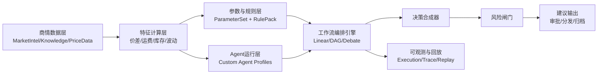

# 智能体工作流编排平台设计方案（玉米交易决策版 v2.6）

## 文档信息
| 字段 | 内容 |
|---|---|
| 文档名称 | 智能体工作流编排平台设计方案（玉米交易决策版） |
| 版本 | v2.6 |
| 编写日期 | 2026-02-10 |
| 当前状态 | 详细设计稿（实施前） |
| 适用范围 | 国内玉米交易决策支持（建议系统，不直接自动下单） |

---

## 1. 本次升级目标（针对你的诉求）

本轮方案升级聚焦三件事：
1. 智能体可定制：每个 Agent 可独立配置角色、模型、提示词、记忆、工具、约束、输出格式。
2. 参数全外置：所有阈值、公式参数、映射规则、风控边界、场景开关均可配置且版本化。
3. 可视化编排细化：对线性模式、DAG 并行模式、多 Agent 辩论模式给出完整的可视化编排规范。

## 1.1 已确认设计约束（本版按此定稿）

1. 触发方式以手工触发和流程编排触发为主，Debate 场景默认手工触发。
2. 流程库不限制两条，需支持持续扩展到多流程全覆盖。
3. 输出对象中 `positionAdvice`、`stopLoss`、`takeProfit` 为可选字段，不做强制。
4. 平台必须展示完整辩论过程（轮次、发言、质询、裁决依据）和最终结果。
5. 参数、阈值、规则、Agent 配置必须支持用户隔离（当前仅个人私有，不启用团队共享）。
6. 支持公共模板：普通用户可引用公共模板，管理员维护并发布官方公共模板。
7. Agent 角色可配置多套（含期货、现货、物流、风控等），轮次可自定义。
8. 运费在当前阶段仅采用手工维护，后续再对接智能物流模块。
9. 审批能力保留但 P0 默认不启用（流程不强制审批节点）。
10. 证据链必须包含三类证据：原文片段、指标快照、规则命中；来源以商情中心入库数据为主。
11. v1 必须支持同一策略多版本并行灰度（A/B 对照）。
12. 首期同时建设“策略设计编排端”和“运行回放分析端”。
13. 标准区域/线路字典由管理员统一维护并发布。
14. 运费手工维护频率先按周更执行。
15. Debate 结果页支持 PDF/Word 导出。
16. A/B 自动止损阈值默认 `badCaseThreshold=0.2`。
17. 使用方式需明确区分：定时触发、手工触发、智能/条件触发、按需触发。
18. 人机协同操作保持简洁，默认仅保留“批准/驳回”两类动作。

---

## 2. 现有系统能力基线（As-Is，复用前提）

## 2.1 已具备核心底座

1. AI 配置与调用
- `AIModelConfig`、`ConfigService`、`AIService` 已支持多 Provider、模型切换、连接测试、配置缓存。

2. Prompt 管理
- `PromptTemplate`、`PromptService` 已支持模板管理、变量渲染、版本递增。

3. 商情数据沉淀
- `MarketIntel`、`PriceData`、`MarketEvent`、`MarketInsight`、`ResearchReport`、`KnowledgeItem` 已形成结构化沉淀。

4. 规则与字典
- 已有 `ExtractionRule`、`BusinessMappingRule`、`MarketAlertRule`、`DictionaryDomain/DictionaryItem`。

5. 调度执行能力
- `IntelTaskTemplate`、`IntelTaskRule`、`TaskSchedulerService` 支持周期触发和规则分发。

## 2.2 当前不足（必须补齐）

1. 缺统一“决策规则层”（交易规则和提取规则尚未统一编排）。
2. 缺统一“流程 DSL 和节点契约”（现有配置偏分散）。
3. 缺“智能体协作协议”（辩论机制和裁决机制未标准化）。
4. 缺“决策输出标准对象”（建议结构和证据链未强制统一）。

---

## 3. 总体目标架构（To-Be）



---

## 4. 智能体定制化设计（高灵活）

## 4.1 Agent 配置模型（AgentProfile）

每个 Agent 必须是“可配置对象”，而不是写死逻辑。

建议字段：
1. `agentCode`：唯一编码。
2. `agentName`：名称。
3. `roleType`：角色类型（分析师/风控/裁判/执行建议等）。
4. `objective`：目标描述。
5. `modelConfigKey`：绑定 `AIModelConfig`。
6. `agentPromptCode`：绑定 `AgentPromptTemplate`。
7. `memoryPolicy`：记忆策略（none/short-term/windowed）。
8. `toolPolicy`：可调用工具白名单。
9. `guardrails`：约束（禁用编造数据、必须给证据、输出长度限制）。
10. `outputSchemaCode`：输出结构 schema。
11. `timeoutMs` / `retryPolicy`：执行策略。
12. `isActive` / `version`：版本治理。

## 4.2 Agent 输出强约束

所有 Agent 输出必须结构化，但支持“基础字段 + 角色扩展字段”：
1. 基础字段（所有 Agent 必须有）：`thesis`、`confidence`、`evidence[]`。
2. 扩展字段（按角色 schema）：`risks[]`、`assumptions[]`、`spreadView`、`freightView`、`nextAction` 等。
3. 不同 Agent 可绑定不同 `outputSchemaCode`，不强制统一一份大 schema。

## 4.3 Agent 角色模板（建议内置）

1. `MarketAnalystAgent`：读市场情绪与事件。
2. `CostSpreadAgent`：算成本、运费、价差、套利空间。
3. `FuturesExpertAgent`：期货视角评估基差与套保逻辑。
4. `SpotExpertAgent`：现货流通与区域供需判断。
5. `LogisticsExpertAgent`：物流链与运费异常诊断。
6. `RiskOfficerAgent`：硬风控与否决建议。
7. `ExecutionAdvisorAgent`：把观点转成交易语言。
8. `JudgeAgent`：处理分歧，输出最终建议。

## 4.4 Agent 可配置项分层

1. 角色层：职责和输出格式。
2. 模型层：模型、温度、token、重试。
3. Prompt 层：模板与变量（使用 `AgentPromptTemplate`）。
4. 工具层：允许访问的数据与函数。
5. 治理层：发布、回滚、可见范围控制。

## 4.5 Agent 提示词模板（AgentPromptTemplate，独立表）

**设计决策**：为避免污染现有 `PromptTemplate`（已服务于商情情报提取场景，分类枚举为 `IntelCategory`），Agent 专用提示词单独建表。

建议字段：
1. `code`：唯一编码（如 `MARKET_ANALYST_SYSTEM_V1`）。
2. `name`：模板名称。
3. `agentRoleType`：关联 Agent 角色类型（`ANALYST/RISK_OFFICER/JUDGE/COST_SPREAD/...`）。
4. `systemPrompt`：系统提示词（定义角色、目标、约束）。
5. `userPromptTemplate`：用户 Prompt 模板（含变量占位符）。
6. `variables`：可用变量及其说明（JSON）。
7. `outputSchemaCode`：绑定的输出 Schema 编码。
8. `guardrails`：内置约束（禁止编造数据、必须给证据等，JSON）。
9. `version`：版本号（每次修改自动递增）。
10. `previousVersionId`：上一版本引用（支持回滚）。
11. `isActive`：是否启用。
12. `ownerType`：`SYSTEM/ADMIN/USER`。
13. `ownerUserId`：用户自定义时必填。

与现有 `PromptTemplate` 的关系：
- `PromptTemplate`：继续服务于商情情报提取（日报生成、事件提取、洞察提取等），分类维度为 `IntelCategory`。
- `AgentPromptTemplate`：专门服务于决策工作流中的 Agent 节点，分类维度为 `agentRoleType`。
- 两张表完全独立，通过不同的编码命名空间隔离。

---

## 5. 参数全外置设计（100%可定制）

## 5.1 参数对象模型（ParameterItem）

建议字段：
1. `paramCode`：参数编码。
2. `paramName`：参数名称。
3. `paramType`：number/string/boolean/enum/json/expression。
4. `unit`：单位（元/吨、%、天）。
5. `value`：值。
6. `defaultValue`：默认值。
7. `minValue` / `maxValue`：硬边界。
8. `scope`：作用域。
9. `ownerType`：`SYSTEM/ADMIN/USER`。
10. `ownerUserId`：用户参数时必填。
11. `templateSource`：`PUBLIC_TEMPLATE/PRIVATE_TEMPLATE/RUNTIME_OVERRIDE`。
12. `inheritedFrom`：继承来源（模板或上级参数包）。
13. `effectiveFrom` / `effectiveTo`：生效区间。
14. `version`：版本号。
15. `source`：来源（默认/行业/经验/临时）。
16. `changeReason`：变更原因（必填审计字段）。

## 5.2 参数作用域（Scope）

支持多层作用域：
1. `PUBLIC_TEMPLATE`：公共模板默认值（管理员维护）。
2. `USER_TEMPLATE`：用户私有模板默认值。
3. `GLOBAL`：用户或模板内全局参数。
4. `COMMODITY`：按品种。
5. `REGION`：按区域。
6. `ROUTE`：按路径（如北粮南运）。
7. `STRATEGY`：按策略模板。
8. `SESSION`：单次运行临时覆盖。

## 5.3 参数优先级（覆盖顺序）

统一覆盖顺序（低到高）：
1. 公共模板默认。
2. 用户私有模板默认。
3. 用户全局参数。
4. 品种参数。
5. 区域参数。
6. 路径参数。
7. 策略参数。
8. 临时覆盖参数（单次运行）。

## 5.4 参数包（ParameterSet）

每个流程绑定一组参数包：
1. `BASELINE_SET`：基准参数。
2. `VOLATILE_SET`：高波动场景。
3. `POLICY_SHOCK_SET`：政策冲击场景。
4. `TRADER_EXPERIENCE_SET`：交易员经验参数。

参数包分三类：
1. `SYSTEM_PUBLIC`：管理员官方模板，可全员引用。
2. `USER_PRIVATE`：用户私有模板，默认仅本人可见。
3. `TEAM_PUBLIC`：预留（当前阶段不启用）。

## 5.5 参数校验机制

1. 类型校验：类型与单位一致性。
2. 区间校验：上下界强校验。
3. 依赖校验：跨参数关系校验。
4. 作用域校验：用户运行时禁止读取他人私有参数。
5. 发布校验：生产流程必须绑定可追溯版本（私有或公共均可）。

## 5.6 参数 UI 交互要求

参数配置界面必须实现以下交互能力，防止用户在多层覆盖中迷失：

1. **继承状态可视化**：每个参数项必须显示当前生效值的来源层级（公共模板/用户模板/品种/区域/策略/临时覆盖），使用颜色标签区分。
2. **一键回退到模板默认**：用户自定义参数后，提供"恢复默认"按钮，一键清除当前层级覆盖，回退到上级继承值。
3. **批量回退**：支持按作用域批量还原到公共模板默认值（如一键清除所有用户私有覆盖）。
4. **覆盖对比视图**：支持展示"公共模板默认值 vs 当前生效值"的差异对比（diff），帮助用户理解哪些参数被修改过。
5. **覆盖影响预览**：修改参数时，预览该修改会影响哪些流程和 Agent 节点。
6. **变更审计日志**：参数变更记录完整的操作人、时间、前后值、变更原因，支持按时间线回溯。

---

## 6. 规则体系设计（统一而非分散）

## 6.1 规则分层

1. `DefaultRule`：通用底线（数据质量、极值拦截、风险限额）。
2. `IndustryRule`：玉米行业逻辑（价差、运费、季节性、替代品）。
3. `ExperienceRule`：交易员历史经验规则。
4. `RuntimeOverrideRule`：单次运行临时规则。

## 6.2 与现有规则系统映射

1. `ExtractionRule`：保留为文本提取规则。
2. `BusinessMappingRule`：保留为标准化映射规则。
3. `MarketAlertRule`：保留为告警规则。
4. 新增 `DecisionRulePack`：交易决策规则包。

## 6.3 规则包（RulePack）

1. `rulePackCode`：规则包编码。
2. `applicableScopes`：适用范围。
3. `priority`：优先级。
4. `rules[]`：规则列表。
5. `version`：版本。
6. `ownerType` / `ownerUserId`：归属（公共/用户私有）。
7. `publishedBy`：发布人。

---

## 7. 可视化流程编排详细设计（重点）

## 7.1 Studio 总体布局

1. 左侧：节点库（按分类）。
2. 中间：无限画布（支持网格、缩放、分组、对齐）。
3. 右侧：属性面板（节点配置、参数映射、调试信息、用户私有参数覆盖）。
4. 底部：运行日志与变量观察器。
5. 右下：辩论过程面板（轮次时间线、发言内容、质询记录、裁决依据）。

## 7.2 画布交互能力

1. 拖拽创建节点。
2. 端口连线（输入/输出端口强类型约束）。
3. 框选、分组、批量移动。
4. 子流程折叠/展开。
5. 节点复制为模板。
6. 一键对齐、自动布局。
7. 版本 diff（查看两个版本流程差异）。
8. 三种模式一键切换（线性、DAG、Debate），并实时提示结构性缺失节点。
9. 节点级参数覆盖开关（引用公共模板/切换到用户私有覆盖）。

## 7.3 节点标准契约（Node Contract）

每个节点必须定义：
1. `nodeType`：节点类型。
2. `inputsSchema`：输入 schema。
3. `outputsSchema`：输出 schema。
4. `configSchema`：配置 schema。
5. `runtimePolicy`：超时、重试、降级。
6. `validator`：保存前校验器。

## 7.4 节点分类（详细）

1. 触发节点：`cron-trigger`、`event-trigger`、`manual-trigger`、`api-trigger`（玉米交易 P0 默认 `manual-trigger`）。
2. 数据节点：`market-data-fetch`、`knowledge-fetch`、`report-fetch`、`external-api-fetch`。
3. 计算节点：`formula-calc`、`feature-calc`、`quantile-calc`。
4. 规则节点：`rule-eval`、`rule-pack-eval`、`alert-check`。
5. Agent 节点：`single-agent`、`agent-group`、`debate-round`。
6. 控制节点：`if-else`、`switch`、`parallel-split`、`join`。
7. 决策节点：`decision-merge`、`risk-gate`、`approval`（风险分级触发，可选）。
8. 输出节点：`notify`、`report-generate`、`dashboard-publish`。

## 7.5 连线语义（Edge Semantics）

1. `data-edge`：传递数据对象。
2. `control-edge`：传递执行控制。
3. `condition-edge`：带条件表达式。
4. `error-edge`：异常分支。

## 7.6 变量映射与表达式

1. 支持可视化变量选择器（上游输出字段选择）。
2. 支持表达式映射（如 `{{price.spread}} > {{params.threshold_spread}}`）。
3. 支持默认值与空值策略。
4. 支持字段级数据血缘追踪。

## 7.7 子流程（Subflow）

1. 子流程可独立版本化。
2. 主流程通过输入输出端口调用子流程。
3. 常用子流程沉淀为“策略组件”。

---

## 8. 三种编排模式的详细设计（流程结构维度）

## 8.1 线性模式（Linear）

适用：稳定日常场景，强调可解释与稳定输出。

标准链路：
1. `trigger`。
2. `data-fetch`。
3. `feature-calc`。
4. `rule-eval`。
5. `single-agent`。
6. `decision-merge`。
7. `risk-gate`。
8. `notify`。
9. `approval`（扩展能力，P0 默认关闭）。

关键配置：
1. 单路径执行，无并行分支。
2. 每步可配置重试和降级。
3. 输出必须产出完整证据链（原文片段+指标快照+规则命中）。

## 8.2 DAG 并行模式（Dependency Graph Parallel）

适用：多数据源、多逻辑并发计算，追求时效。

标准链路：
1. `trigger`。
2. `parallel-split`。
3. 并行子链路 A（成本线）。
4. 并行子链路 B（供需线）。
5. 并行子链路 C（情绪/政策线）。
6. `join`（汇聚策略可配置）。
7. `decision-merge`。
8. `risk-gate`。
9. `notify`。
10. `approval`（扩展能力，P0 默认关闭）。

`join` 汇聚策略建议：
1. `ALL_REQUIRED`：全部完成才继续。
2. `QUORUM`：达到最小分支数量继续。
3. `FIRST_SUCCESS`：首个成功分支触发继续。
4. `WEIGHTED_MERGE`：按分支权重合成。

## 8.3 多 Agent 辩论模式（Multi-Agent Debate）

适用：高不确定性或高分歧行情。

标准链路：
1. `manual-trigger`（默认）。
2. `context-builder`（统一上下文）。
3. `debate-round`（可配置角色组发言与反驳）。
4. `debate-round`（可配置角色组质询）。
5. `debate-round`（可配置角色组补充证据）。
6. 重复回合（最大轮次可配）。
7. `judge-agent`（裁决输出）。
8. `risk-gate`。
9. `notify`。
10. `approval`（扩展能力，P0 默认关闭）。

辩论控制参数：
1. `maxRounds`：最大轮次（手工可配，不设固定值）。
2. `earlyStopRule`：提前停止规则（观点收敛阈值）。
3. `roleOrder`：发言顺序（角色模板可替换）。
4. `challengeRule`：允许质询次数。
5. `judgePolicy`：裁决策略（多数投票/加权评分/风控优先）。

辩论过程可视化必须输出：
1. 每轮完整发言文本与时间戳。
2. 每轮观点变化（立场、置信度变化）。
3. 质询与回应配对关系。
4. 裁判判决依据（证据、规则、风险条款）。
5. 可回放“逐轮重演”视图。

## 8.4 首批扩展流程库（建议一次设计，多批上线）

1. `晨间线性决策`：开盘前快速建议。
2. `盘中异动复核`：事件冲击后再判断。
3. `并行套利决策`：区域价差与成本并行计算。
4. `政策冲击辩论`：政策发布后的多角色辩论。
5. `库存拐点预警`：库存阈值触发分析。
6. `运费异常复盘`：运费手工更新后的再评估。
7. `周度策略复盘`：一周建议质量回放与调参。
8. `月度规则回测`：规则命中率和收益代理复盘。
9. `期货结构雷达`：主力合约结构、波动和资金行为扫描。
10. `基差套利与套保建议`：现货-期货联动判断与套保比例建议。
11. `期现联动预警`：现货异动是否传导至期货，反向亦然。
12. `盘后组合复盘`：建议质量、风险暴露与参数偏差分析。
13. `虚拟期货组合沙盘`：基于模拟持仓做策略验证与压力测试。

## 8.5 三种使用方式（Usage Methods，运行触发维度）

说明：编排模式（Linear/DAG/Debate）和使用方式（如何触发、是否需要人拍板）是两个维度，可交叉组合。

方式一：后台全自动（Headless Automation）
1. 模式：无人值守。
2. 触发：`cron-trigger` 或事件触发。
3. 体验：用户默认无感，仅接收告警与报告。
4. 建议场景：日报/周报生成、库存阈值预警、定时策略扫描。

方式二：人机协同（Copilot / Human-in-the-loop）
1. 模式：AI 给建议，人类拍板。
2. 触发：手工触发或自动触发后进入人工确认节点。
3. 体验：界面展示“建议理由 + 风险提示 + 证据链”，用户仅做“批准/驳回”。
4. 建议场景：高价值交易建议、政策冲击后的临盘决策、争议信号复核。

方式三：按需触发（On-Demand Trigger）
1. 模式：作为 API 或按钮能力随取随用。
2. 触发：`api-trigger` 或页面按钮触发（如“智能风险评估”）。
3. 体验：交易员在下单前一键触发，系统返回实时风险与建议摘要。
4. 建议场景：下单前风控检查、单笔交易快速复核、临时情景测算。

## 8.6 触发方式分层（必须区分）

1. 定时触发（Scheduled）
- 节点：`cron-trigger`。
- 适用：周期巡检、日报周报、库存与价差常规扫描。

2. 手工触发（Manual）
- 节点：`manual-trigger`。
- 适用：交易员临盘判断、策略试跑、辩论流程发起。

3. 智能/条件触发（Intelligent / Conditional）
- 节点：`event-trigger` + `condition-edge` + `rule-eval`。
- 适用：价差越阈值、政策事件更新、风险评分升档。

4. 按需触发（On-Demand）
- 节点：`api-trigger`。
- 适用：交易界面按钮调用、外部系统实时请求。

## 8.7 五大高价值场景蓝图（角色+触发+流程）

| 场景 | 角色类型 | 推荐编排模式 | 推荐使用方式 | 主触发方式 | 备用触发 |
|---|---|---|---|---|---|
| 全天候套利猎手 | `Calculator Agent` | `DAG` | `HEADLESS` | 定时（每 5 分钟） | 条件触发（利润越阈值） |
| 政策与舆情分析师 | `Knowledge Agent` | `LINEAR` | `HEADLESS/COPILOT` | 定时（04:00） | 事件触发（站点更新） |
| 物流风险预警官 | `Predictive Agent` | `DAG` | `HEADLESS` | 定时（每 12 小时） | 条件触发（路径重合度越阈值） |
| 智能合同审核员 | `Task Agent` | `LINEAR` | `ON_DEMAND/COPILOT` | Webhook/API 触发 | 手工补审触发 |
| 库存优化军师 | `Decision Support Agent` | `LINEAR/DEBATE` | `COPILOT` | 定时（每周五） | 手工重跑触发 |

## 8.8 场景流程细化（可直接映射画布节点）

场景一：全天候套利猎手（The Arbitrage Hunter）
1. 触发：`cron-trigger` 每 5 分钟。
2. 感知：北港价格节点 + 南港价格节点 + 物流费节点（P0 手工参数，后续接物流 API）。
3. 计算：`Profit = P_south - P_north - Cost_ship - (interest + port_fee)`。
4. 决策：`IF Profit > 30`。
5. 行动：高优先级通知（企微/钉钉）+ 机会日志入库。

场景二：政策与舆情分析师（The Policy Analyst）
1. 触发：凌晨 4:00 定时 + 站点更新事件触发。
2. 感知：报告下载节点 + 新闻采集节点。
3. 思考：LLM 提取“中国进口需求/美玉米产量预期”并判定利多利空。
4. 行动：生成 200 字晨间内参 + 邮件分发。

场景三：物流风险预警官（The Logistics Sentinel）
1. 触发：每 12 小时。
2. 感知：在途船舶轨迹 + 气象路径。
3. 思考：路径重合度计算 + LLM 风险解释与改靠建议。
4. 行动：高风险短信告警给物流经理。

场景四：智能合同审核员（The Contract Auditor）
1. 触发：合同上传 Webhook（`api-trigger`）。
2. 感知：OCR 节点抽取合同文本。
3. 思考：RAG 对比标准模板与黑名单条款，定位差异。
4. 行动：输出“通过/驳回”建议及差异说明，写入合同审阅意见流。

场景五：库存优化军师（The Inventory Strategist）
1. 触发：每周五定时运行。
2. 感知：ERP 库存与成本 + 两周价格趋势预测。
3. 思考：结合库存成本与趋势给出“保持/减仓/加仓”建议。
4. 行动：生成周度库存策略报告提交决策会。

## 8.9 实施路线（由简入繁）

第一阶段：构建“耳目”
1. 上线场景：`套利猎手`、`舆情分析师`。
2. 重点：数据采集打通、TriggerNode 与 DataNode 稳定运行。

第二阶段：构建“手脚”
1. 上线场景：`合同审核员`。
2. 重点：PDF/OCR、RAG 检索、流程回写审批意见。

第三阶段：构建“大脑”
1. 上线场景：`物流预警官`、`库存优化军师`。
2. 重点：多源预测、策略回放、参数持续校准。

## 8.10 角色-流程-节点-输入输出映射蓝图（实施主表）

说明：以下映射按“现有可用数据先落地、未来新增数据再增强”组织。

| 角色编码 | 角色类型 | 核心职责 | 现有可用数据（P0） | 未来增强数据（P1+） | 关键输出 | 主要服务流程 |
|---|---|---|---|---|---|---|
| `SpotSupplyDemandAgent` | 现货分析 | 供需与库存判断 | `MarketIntel`、`MarketInsight`、库存日报/周报 | 港口实时库存 API、到港节奏 API | `spotDirection`、`supplyDemandScore` | 晨间综判、库存策略 |
| `RegionalSpreadAgent` | 价差计算 | 区域价差与套利窗口 | `PriceData`、区域现货成交价 | 跨市场盘口、实时成交簿 | `spreadValue`、`spreadSignal` | 套利猎手、期现联动 |
| `LogisticsCostAgent` | 物流成本 | 运费与到港成本测算 | 手工运费参数、港杂费、装卸费 | 智能物流运价 API、AIS 船期 | `landedCost`、`freightRisk` | 套利猎手、物流预警 |
| `PolicySentimentAgent` | 知识理解 | 政策与舆情利多利空 | `ResearchReport`、`MarketEvent`、`KnowledgeItem` | 新闻流 API、海外数据库 | `sentiment`、`policyImpactScore` | 舆情分析、政策冲击 |
| `FuturesStructureAgent` | 期货分析 | 期限结构/波动/主力状态 | 现有交易信息、研报中的期货观点 | 交易所实时行情、持仓结构 | `futuresBias`、`termStructureState` | 期货结构雷达 |
| `BasisArbitrageAgent` | 期现联动 | 基差、升贴水、套利判定 | 现货价 + 期货结算价（可导入） | 实时基差曲线、跨期价差曲线 | `basisSignal`、`arbitrageWindow` | 基差套利与套保 |
| `HedgeRatioAgent` | 决策辅助 | 套保比例与节奏建议 | 库存量、成本、历史波动 | 相关性矩阵、风险因子模型 | `hedgeRatio`、`hedgePlan` | 套保建议、周度策略 |
| `VirtualPositionMonitorAgent` | 模拟监控 | 虚拟持仓风险与盈亏监控 | `VirtualFuturesPosition`、`VirtualTradeLedger` | 实盘映射与压力测试结果 | `simRiskLevel`、`simPnlSummary` | 期货沙盘、复盘评估 |
| `RiskGateAgent` | 风控 | 阈值阻断与降级策略 | 规则包、风险参数包 | 实时风控引擎、资金占用接口 | `riskLevel`、`blockers[]` | 全流程通用 |
| `DecisionFusionAgent` | 合成裁决 | 多角色信号融合 | 上游全部 Agent 输出 | 历史绩效权重模型 | `action`、`confidence` | 全流程通用 |
| `ReplayLearningAgent` | 复盘学习 | 回放评估与参数校准 | `WorkflowExecution`、`DecisionRecord` | 自动调参/贝叶斯优化 | `driftReport`、`paramTuningAdvice` | 周/月复盘 |

## 8.11 流程蓝图映射（触发 + 节点 + 输入输出）

| 流程名 | 目标 | 编排模式 | 使用方式 | 主触发 | 核心节点链 | 输入重点 | 输出重点 |
|---|---|---|---|---|---|---|---|
| 全天候套利猎手 | 捕捉南北价差机会 | `DAG` | `HEADLESS` | `cron-trigger(5m)` | `price-fetch x2 -> freight-cost -> formula-calc -> rule-eval -> notify` | 北港/南港价格、运费、资金/港杂费 | `profitEstimate`、套利告警 |
| 政策与舆情分析师 | 提炼政策与外盘信号 | `LINEAR` | `HEADLESS/COPILOT` | `cron-trigger(04:00)` + `event-trigger` | `report-fetch -> news-fetch -> single-agent -> summary-generate -> notify` | 研报、公告、新闻文本 | 晨间内参、情绪方向 |
| 期货结构雷达 | 识别期货结构变化 | `LINEAR` | `HEADLESS` | `cron-trigger(30m)` | `futures-fetch -> feature-calc -> rule-pack-eval -> notify` | 合约价格、波动、主力信息 | `futuresBias`、结构预警 |
| 基差套利与套保建议 | 期现联动决策 | `DAG` | `COPILOT/ON_DEMAND` | `cron-trigger(1h)` + `manual-trigger` | `spot-fetch + futures-fetch -> basis-calc -> hedge-agent -> decision-merge -> notify` | 现货价、期货价、库存成本 | `basisSignal`、`hedgeRatio` |
| 期现联动预警 | 捕捉跨市场传导 | `DAG` | `HEADLESS` | `event-trigger` + `condition-edge` | `anomaly-detect -> correlation-check -> risk-gate -> notify` | 异动信号、规则阈值 | 联动预警、风险分级 |
| 物流风险预警官 | 提前发现运输风险 | `DAG` | `HEADLESS` | `cron-trigger(12h)` | `route-fetch -> weather-fetch -> overlap-calc -> llm-explain -> notify` | 在途坐标、天气路径 | 物流风险告警 |
| 智能合同审核员 | 合同条款风险审查 | `LINEAR` | `ON_DEMAND/COPILOT` | `api-trigger(webhook)` | `ocr -> rag-retrieve -> compare-agent -> notify` | 合同文本、标准模板、黑名单条款 | 审阅建议（通过/驳回） |
| 库存优化军师 | 库存与价格协同决策 | `LINEAR/DEBATE` | `COPILOT` | `cron-trigger(weekly)` | `erp-fetch -> trend-fetch -> decision-agent -> report-generate` | 库存、成本、未来趋势 | 周度库存策略报告 |
| 虚拟期货组合沙盘 | 模拟仓位与回撤验证 | `LINEAR` | `ON_DEMAND/COPILOT` | `manual-trigger` + `api-trigger` | `sim-position-fetch -> pnl-calc -> risk-gate -> replay-tag -> notify` | 模拟持仓、模拟流水、阈值参数 | `simRiskLevel`、`simPnlSummary` |

## 8.12 场景触发策略清单（定时/手工/智能/按需）

| 场景 | 定时触发 | 手工触发 | 智能/条件触发 | 按需触发 |
|---|---|---|---|---|
| 全天候套利猎手 | 是（5 分钟） | 否 | 是（Profit > 阈值） | 否 |
| 政策与舆情分析师 | 是（04:00） | 是（补跑） | 是（站点更新） | 否 |
| 期货结构雷达 | 是（30 分钟） | 是（盘中复核） | 是（波动越阈值） | 否 |
| 基差套利与套保建议 | 是（1 小时） | 是（交易前） | 是（基差越阈值） | 是（下单前调用） |
| 期现联动预警 | 否 | 否 | 是（跨市场异动条件） | 否 |
| 物流风险预警官 | 是（12 小时） | 是（人工重跑） | 是（风暴重合度越阈值） | 否 |
| 智能合同审核员 | 否 | 是（补审） | 否 | 是（Webhook/API） |
| 库存优化军师 | 是（每周五） | 是（会议前重跑） | 否 | 否 |
| 虚拟期货组合沙盘 | 否 | 是（沙盘启动） | 是（模拟回撤越阈值） | 是（API 发起） |

## 8.13 期货数据接入与虚拟持仓模拟（新增）

## 8.13.1 期货在线数据接入分层

1. 实时层（Real-time）：用于盘中监控、套利雷达、按需风险评估。
2. 延时层（Delayed）：用于晨间综判、回测复盘、低频策略。
3. 归档层（Historical）：用于特征工程、阈值校准、策略回放。

## 8.13.2 期货字段清单（建议首版）

行情与合约字段：
1. `exchange`
2. `symbol`
3. `contractCode`
4. `isMainContract`
5. `deliveryMonth`
6. `tradingSession`
7. `tradingStatus`

价格与盘口字段：
1. `lastPrice`
2. `openPrice`
3. `highPrice`
4. `lowPrice`
5. `preClose`
6. `bid1Price` / `ask1Price`
7. `bid1Volume` / `ask1Volume`
8. `settlementPrice`
9. `preSettlementPrice`

成交与持仓字段：
1. `volume`
2. `turnover`
3. `openInterest`
4. `openInterestChange`
5. `impliedVolatility`（可选）

质量与时效字段：
1. `sourceTs`
2. `ingestTs`
3. `delaySec`
4. `latencyMs`
5. `qualityFlag`

## 8.13.3 虚拟期货模拟持仓字段（用于数据源）

账户与策略字段：
1. `virtualAccountId`
2. `strategyId`
3. `portfolioId`
4. `traderId`

持仓字段：
1. `side`（LONG/SHORT）
2. `positionQty`
3. `availableQty`
4. `avgOpenPrice`
5. `markPrice`
6. `unrealizedPnl`
7. `realizedPnl`
8. `positionValue`
9. `marginUsed`
10. `marginRatio`
11. `leverage`

风控字段：
1. `liqRiskScore`
2. `maxLossLimit`
3. `stopLossLevel`
4. `takeProfitLevel`
5. `riskFlag`

## 8.13.4 首版接入策略

1. P0：接入在线期货行情（实时或延时均可）+ 虚拟持仓模拟表。
2. P1：补齐交易所衍生字段（持仓结构、仓单、主力切换标记）。
3. P2：与风控/执行模块联动，实现“建议-持仓-风险”闭环。

---

## 9. 决策合成与输出标准

## 9.1 决策合成器

建议采用“双轨合成”：
1. 规则轨：硬规则得分和约束。
2. Agent 轨：语义分析得分和证据质量。

最终结果由 `DecisionAggregator` 生成：
1. `action`。
2. `confidence`。
3. `riskLevel`。
4. `reasoningSummary`。
5. `evidenceBundle`。

## 9.2 统一输出对象

必备字段（所有流程）：
1. `action`：看多/看空/观望。
2. `targetWindow`：T+1/T+3/周度。
3. `riskLevel`：低/中/高。
4. `confidence`：0-100。
5. `evidence[]`：证据条目（必须同时包含原文片段、指标快照、规则命中）。

扩展字段（按流程与 Agent 配置）：
1. `positionAdvice`：仓位建议（可选）。
2. `stopLoss` / `takeProfit`：风控边界（可选）。
3. `ruleHits[]`：命中规则与版本。
4. `agentOpinions[]`：Agent 观点摘要。
5. `debateTraceId`：辩论轨迹引用（Debate 模式必填）。
6. `blockers[]`：阻断项。
7. `humanDecision`：人工确认结果。
8. `publishable`：是否可发布（证据链和风险校验后计算）。

## 9.3 证据来源白名单策略

1. P0 白名单数据源：以商情中心已入库实体为主（`MarketIntel`、`ResearchReport`、`MarketEvent`、`MarketInsight`、`KnowledgeItem`）。
2. 外部数据可引用，但默认标注 `externalEvidence=true`，不计入“强证据”配额。
3. 发布到正式建议时，至少 2 条证据必须来自白名单数据源。

## 9.4 On-Demand 返回对象（默认定义）

按需触发接口默认返回以下字段：
1. `action`
2. `confidence`
3. `riskLevel`
4. `evidenceSummary`（证据摘要）
5. `traceId`（回放追踪号）

可选附加字段：
1. `blockers[]`
2. `latencyMs`
3. `modelVersion`

---

## 10. 可观测性与可回放设计

1. 运行实例日志：流程级、节点级、Agent 轮次级。
2. 变量快照：每节点输入输出快照。
3. 参数快照：运行时参数包与覆盖记录。
4. 模型快照：模型版本与 Prompt 版本。
5. 辩论回放：逐轮回放发言、质询、裁决过程。
6. 回放能力：按历史实例重放并比对输出。

## 10.1 运行 SLA（默认定义，审批能力预留）

按使用方式定义默认目标：
1. 后台全自动：`NORMAL=120`、`HIGH=60`、`URGENT=30`（分钟）。
2. 人机协同：分析产出目标同上；若启用审批节点，审批 SLA 默认为 `120/60/30`（分钟）。
3. 按需触发：接口返回目标 `P95 <= 30s`（可配置超时降级）。
4. P0 默认不强制审批节点，SLA 为监控与告警目标，不作为“自动通过”条件。

---

## 11. 产品页面设计（详细）

## 11.1 新增页面

1. `策略与编排中心`
- 策略列表、模板库、规则包绑定、参数包绑定。

2. `Workflow Studio`
- 画布、节点库、属性面板、变量映射、调试台、辩论时间线回放。

3. `Agent 管理中心`
- Agent 角色模板、模型绑定、Prompt 绑定、输出 Schema 管理。

4. `参数中心`
- 参数项管理、参数包管理、公共模板引用、用户私有覆盖、版本发布。

5. `运行与回测中心`
- 运行监控、实例回放、回测对比、版本效果分析、Debate 结果导出（PDF/Word）。

6. `触发接入中心`（新增）
- API 触发凭证、速率限制、调用日志、失败重试策略。

## 11.2 复用现有页面

1. 系统配置中心继续承接：AI 模型、Prompt、字典、映射规则。
2. 提取配置中心继续承接：事件/洞察提取规则。
3. 商情中心继续承接：数据采集、情报入库、知识沉淀。

## 11.3 首期建设方式（双端并行）

1. `策略设计编排端` 与 `运行回放分析端` 同步建设，不分前后期。
2. 先保证最小闭环：可配置流程 -> 可运行 -> 可回放 -> 可复盘调参。

## 11.4 报告导出模板（PDF/Word）

默认导出结构固定包含 4 个部分：
1. 结论页（建议、置信度、风险等级）。
2. 证据页（原文片段、指标快照、规则命中）。
3. 辩论过程页（轮次、发言、裁决依据）。
4. 风险页（阻断项、边界条件、人工结论）。

## 11.5 菜单与功能信息架构（IA）

一级菜单建议：
1. `智能体工作台`
2. `策略与编排`
3. `流程运行中心`
4. `参数与规则中心`
5. `数据与模型中心`
6. `期货模拟中心`
7. `回放与评估`
8. `系统治理`

二级菜单与关键功能：
1. `智能体工作台`
- 今日信号看板、异常告警、待处理任务、快速触发入口。
2. `策略与编排`
- 流程设计器、模板库、角色库、版本管理、发布管理。
3. `流程运行中心`
- 运行列表、实例详情、失败重跑、通知追踪。
4. `参数与规则中心`
- 阈值配置、参数包、规则包、生效窗口、版本对比。
5. `数据与模型中心`
- 数据源接入、字段映射、模型配置、Prompt 配置。
6. `期货模拟中心`
- 虚拟账户、模拟持仓、风控线、模拟成交流水。
7. `回放与评估`
- 回放重演、A/B 评估、指标看板、调参建议。
8. `系统治理`
- 用户权限、模板发布、审计日志、导出中心。

## 11.6 UI 与流程交互设计（重点场景）

场景 A：晨间期现综判（定时 + 人工复核）
1. 工作台收到“晨间综判完成”卡片。
2. 点击进入：左侧结论摘要，右侧证据链与规则命中。
3. 底部展示“期现联动视图”（现货、期货、基差三线）。
4. 用户执行简单动作：`批准` 或 `驳回`。

场景 B：盘中套利雷达（高频定时 + 条件触发）
1. 画面顶部实时显示“当前套利窗口计数”。
2. 触发告警时弹出抽屉：利润估算、成本拆解、风险提示。
3. 支持一键“加入关注”并进入按需重跑。

场景 C：下单前按需风险评估（按钮/API）
1. 交易界面点击“智能风险评估”。
2. 30 秒内返回 `action/confidence/riskLevel/evidenceSummary`。
3. 提供 `traceId` 跳转至回放页面查看明细。

## 11.7 参数设置页面分组（全面阈值配置）

1. `现货组`：区域价差、库存预警、到货阈值。
2. `期货组`：波动阈值、主力切换阈值、持仓变化阈值。
3. `期现组`：基差阈值、套利利润阈值、套保比例阈值。
4. `物流组`：运费阈值、延误阈值、损耗阈值。
5. `风险组`：仓位上限、回撤上限、单笔损失上限。
6. `运行组`：触发频率、超时、重试、降级策略。

---

## 12. 数据模型增量设计（含优先级与实施策略）

### 12.1 与现有 IntelTask 的关系声明

**设计决策**：新工作流系统与现有 `IntelTask`（采集任务分发）完全独立，不复用、不混用。

- `IntelTask` / `IntelTaskTemplate` / `IntelTaskRule` ：继续服务于人工采集任务的分发、提交、审核流程。
- `WorkflowDefinition` / `WorkflowExecution`：专门服务于智能体决策流程的编排、执行、回放。
- 两者通过证据链关联：采集任务产出的 `MarketIntel` / `PriceData` 等数据可被决策工作流作为输入数据源引用，但不存在流程结构上的耦合。

### 12.2 新增实体清单（按实施优先级分组）

#### P0 核心模型（首期必须建设，支撑最小闭环）

1. `WorkflowDefinition`
   - 流程定义元数据（名称、模式、使用方式、状态、归属用户）。
   - 不存储节点/连线 JSON，仅存储流程级元信息。

2. `WorkflowVersion`
   - 流程版本快照，每次保存自动生成新版本（不可变快照）。
   - 核心字段：`versionCode`、`dslSnapshot`（完整 JSON 快照，含 nodes/edges/layout）、`changelog`、`status`（DRAFT/PUBLISHED/ARCHIVED）、`publishedAt`。
   - **版本策略**：编辑时始终操作最新草稿版本；发布时冻结当前版本为 PUBLISHED，并自动创建新草稿。
   - **可视化 diff**：前端读取任意两个版本的 `dslSnapshot`，做节点/连线/配置级差异对比。

3. `WorkflowExecution`
   - 运行实例状态（关联 `WorkflowVersion`，非 `WorkflowDefinition`，确保回放可追溯到精确版本）。
   - 核心字段：`executionId`、`workflowVersionId`、`triggerType`、`triggerUserId`、`status`、`startedAt`、`completedAt`、`paramSnapshot`（运行时参数快照）。

4. `NodeExecution`
   - 节点执行明细（输入/输出快照、耗时、错误信息）。
   - **存储策略**：高频触发场景（如套利猎手），建议通过控制触发频率（可配置 cron 间隔）或使用手动触发来管理数据量；系统默认保留 90 天执行记录，超期自动归档到冷存储。

5. `AgentProfile`
   - Agent 定义与版本，绑定 `AIModelConfig` 和 `AgentPromptTemplate`（见 4.5 节）。

6. `AgentPromptTemplate`
   - Agent 专用提示词模板（独立于现有 `PromptTemplate`，见 4.5 节完整定义）。

7. `ParameterSet` / `ParameterItem`
   - 参数包与参数项，取代散落在各处的硬编码参数。

8. `DecisionRulePack` / `DecisionRule`
   - 决策规则包，与现有 `ExtractionRule`（文本提取）和 `MarketAlertRule`（预警）共存，专注于交易决策判断。

9. `DecisionRecord`
   - 交易建议记录与人工审批结果，承载完整证据链。

10. `DataConnector`
    - 统一数据适配层注册表（见 12.3 节 DataConnector 接口规范）。

#### P1 增强模型（核心闭环验证后建设）

11. `TemplateCatalog`
    - 公共模板与用户模板元数据（类型、可见范围、继承关系）。P0 阶段用 `ownerUserId` + `ownerType` 字段即可区分公共/私有。

12. `UserConfigBinding`
    - 用户与参数包/规则包/Agent 模板的绑定关系。P0 阶段直接在各实体上用 `ownerUserId` 关联。

13. `WorkflowExperiment`
    - 多版本灰度实验定义（A/B 分组规则、目标指标、生效范围）。

14. `WorkflowExperimentRun`
    - 实验运行结果（版本命中率、建议差异、命中收益、风险事件）。

#### P2 辩论与扩展模型（随 Debate 模式上线建设）

15. `DebateRoundTrace`
    - 每轮辩论发言、质询、裁决依据、时间戳。随 Debate 模式一起上线。

#### P2+ 期货与模拟模型（随外部数据源接入建设）

16. `FuturesQuoteSnapshot`
    - 期货实时/延时行情快照（合约、盘口、成交、时效字段）。

17. `FuturesDerivedFeature`
    - 期货衍生特征（波动、期限结构、持仓变化、主力切换信号）。

18. `VirtualFuturesPosition`
    - 虚拟持仓数据（方向、数量、均价、浮动盈亏、保证金、风险标记）。

19. `VirtualTradeLedger`
    - 模拟成交流水（开平仓、费用、滑点、策略归因）。

### 12.3 DataConnector 接口规范（统一数据适配层）

**设计目标**：为所有数据节点（`market-data-fetch`、`knowledge-fetch`、`report-fetch`、`external-api-fetch` 等）提供统一的数据获取抽象层，使新数据源接入只需注册新 Connector 而无需修改引擎核心。

#### 12.3.1 DataConnector 注册表模型

建议字段：
1. `connectorCode`：唯一编码（如 `INTERNAL_PRICE_DATA`、`INTERNAL_KNOWLEDGE`、`EXTERNAL_FUTURES_API`）。
2. `connectorName`：数据源名称。
3. `connectorType`：连接器类型（`INTERNAL_DB` / `REST_API` / `GRAPHQL` / `FILE_IMPORT` / `WEBHOOK`）。
4. `category`：数据分类（`PRICE` / `KNOWLEDGE` / `EVENT` / `REPORT` / `FUTURES` / `LOGISTICS` / `WEATHER`）。
5. `endpointConfig`：连接配置（JSON，含 URL/认证/Header 等，`INTERNAL_DB` 类型可为空）。
6. `queryTemplates`：预定义查询模板（JSON，支持参数化查询）。
7. `responseMapping`：响应字段映射规则（JSON，将外部数据结构映射为节点标准输出 Schema）。
8. `freshnessPolicy`：数据新鲜度策略（最大缓存时间、过期降级行为）。
9. `rateLimitConfig`：限流配置（QPS/QPM，仅外部 API 类型需要）。
10. `healthCheckConfig`：健康检查配置（探活 URL、间隔、超时）。
11. `fallbackConnectorCode`：兜底数据源编码（主数据源不可用时自动切换）。
12. `isActive` / `version`：状态与版本。
13. `ownerType`：`SYSTEM/ADMIN`（数据连接器统一管理，不开放用户自建）。

#### 12.3.2 内置 Connector（P0 首期注册）

| connectorCode | connectorType | category | 数据来源 | 说明 |
|---|---|---|---|---|
| `INTERNAL_PRICE_DATA` | `INTERNAL_DB` | `PRICE` | `PriceData` 表 | 价格数据查询 |
| `INTERNAL_MARKET_INTEL` | `INTERNAL_DB` | `EVENT` | `MarketIntel` + `MarketEvent` | 市场情报与事件 |
| `INTERNAL_MARKET_INSIGHT` | `INTERNAL_DB` | `EVENT` | `MarketInsight` | 市场洞察 |
| `INTERNAL_KNOWLEDGE` | `INTERNAL_DB` | `KNOWLEDGE` | `KnowledgeItem` | 知识库 |
| `INTERNAL_RESEARCH_REPORT` | `INTERNAL_DB` | `REPORT` | `ResearchReport` | 研究报告 |
| `INTERNAL_ALERT_RULE` | `INTERNAL_DB` | `EVENT` | `MarketAlertRule` + `MarketAlertInstance` | 预警规则与实例 |
| `INTERNAL_DICTIONARY` | `INTERNAL_DB` | `REFERENCE` | `DictionaryDomain` + `DictionaryItem` | 数据字典（品种/区域/线路等） |
| `MANUAL_FREIGHT_PARAM` | `INTERNAL_DB` | `LOGISTICS` | `ParameterItem`（运费类参数） | 手工运费参数（P0 阶段） |

#### 12.3.3 扩展 Connector（P1+ 后续注册）

| connectorCode | connectorType | category | 说明 |
|---|---|---|---|
| `EXTERNAL_FUTURES_API` | `REST_API` | `FUTURES` | 交易所/终端期货行情 API |
| `EXTERNAL_AIS_SHIP` | `REST_API` | `LOGISTICS` | AIS 船舶轨迹 API |
| `EXTERNAL_WEATHER` | `REST_API` | `WEATHER` | 气象路径 API |
| `EXTERNAL_NEWS_FEED` | `REST_API` | `EVENT` | 新闻流 API |
| `FILE_ERP_INVENTORY` | `FILE_IMPORT` | `PRICE` | ERP 库存文件导入 |

#### 12.3.4 节点与 Connector 的绑定关系

数据节点的 `dataSourceCode` 字段直接引用 `DataConnector.connectorCode`。引擎执行时：
1. 根据 `connectorCode` 查询 `DataConnector` 注册表。
2. 根据 `connectorType` 选择对应的执行器（DB Query / HTTP Client / File Reader）。
3. 使用 `queryTemplates` + 节点的 `filters` / `lookbackDays` 等参数构造查询。
4. 使用 `responseMapping` 将返回数据映射为节点标准输出 Schema。
5. 根据 `freshnessPolicy` 判断是否使用缓存或标记 `dataConfidence=LOW`。

### 12.4 多品种扩展策略（引用数据字典）

**设计决策**：参数编码中的品种维度通过引用现有 `DictionaryDomain`（数据字典）实现动态扩展，而非硬编码品种名称。

具体策略：
1. 在 `DictionaryDomain` 中维护品种字典（`COMMODITY` 域），如 `CORN`（玉米）、`SOYBEAN`（大豆）、`WHEAT`（小麦）。
2. `ParameterItem` 的 `scope=COMMODITY` 时，`scopeValue` 引用字典编码（如 `CORN`）。
3. 新增品种时，只需在数据字典中增加条目，参数体系自动适配——无需修改参数编码或表结构。
4. 区域（`REGION`）和线路（`ROUTE`）同理，引用 `DictionaryDomain` 中对应的 `REGION` 和 `ROUTE` 域。
5. 管理员通过"数据字典管理"页面统一维护品种/区域/线路的标准编码，确保全系统一致性。

---

## 13. 治理与权限设计

1. 角色权限
- `ADMIN`（系统治理）
- `TEMPLATE_ADMIN`（公共模板维护）
- `TRADER_USER`（私有策略和参数）
- `REVIEWER`（风险复核）
- `VIEWER`（只读）

2. 发布流程
- 草稿 -> 校验通过 -> 发布（轻流程）。

3. 审批约束
- 默认不强制多级审批。
- `approval` 能力保留，但 P0 默认不启用。
- 人机协同场景可启用 `approval`，支持 `SINGLE` 与 `MULTI`，由策略作者配置。

4. 审计要求
- 任意建议可追溯到规则、参数、模型、流程版本。

5. 用户隔离
- 参数、规则、Agent、流程定义按 `ownerUserId` 强隔离。
- 用户仅能编辑自己的私有对象，可读取公共模板。
- 公共模板采用“只读引用 + 本地覆写”模式，覆写不回写公共模板。

6. 公共模板发布权限
- 仅 `ADMIN/TEMPLATE_ADMIN` 可创建和发布公共模板。
- 普通用户仅可“复制公共模板到私有空间”后修改。

7. 模板继承链
- `ADMIN_PUBLIC_TEMPLATE` -> `USER_CLONED_TEMPLATE` -> `SESSION_OVERRIDE`。

---

## 14. 实施前评审清单（按已确认约束冻结）

1. 首批流程库：不限制两条，按优先级分批上线（建议至少覆盖线性、DAG、Debate 各 1 条）。
2. 首批触发方式：手工触发为主，后续再逐步开放事件触发。
3. 证据链校验：发布前必须校验三类证据齐全且白名单来源达标。
4. 用户隔离校验：发布前必须通过跨用户读写隔离测试。
5. v1 灰度能力：同策略双版本 A/B 并行运行可用。
6. 运费数据：当前仅手工录入；智能物流数据源作为后续增强项。
7. 首期交付范围：策略设计编排端与运行回放分析端必须同时可用。
8. 使用方式覆盖：后台全自动、人机协同、按需触发三种方式均可配置。

---

## 15. 结论

你要的“高灵活+高可视+高定制”是可以做到的，且不需要推翻现有系统。关键做法是：
1. 把现有能力统一在一个编排中枢之下。
2. 把 Agent、规则、参数全部做成版本化配置对象。
3. 让线性、DAG、辩论三种模式在同一画布和同一执行引擎下运行。
4. 用“用户私有配置 + 公共模板继承 + 审批能力预留 + 强审计”平衡灵活性与治理。


---

## 16. 节点属性面板字段级配置清单（可直接落地到前端表单）

## 16.1 所有节点通用字段（BaseNodeConfig）

| 字段 | 类型 | 必填 | 默认值 | 校验规则 | 说明 |
|---|---|---|---|---|---|
| `nodeId` | string | 是 | - | 全局唯一，`^[a-zA-Z0-9_-]{4,64}$` | 节点唯一标识 |
| `nodeName` | string | 是 | - | 2-50 字 | 画布显示名称 |
| `nodeType` | enum | 是 | - | 必须在节点注册表内 | 节点类别 |
| `enabled` | boolean | 是 | `true` | - | 是否启用 |
| `description` | string | 否 | `""` | <= 500 字 | 业务说明 |
| `tags` | string[] | 否 | `[]` | 每个 tag <= 20 字 | 分类检索 |
| `timeoutMs` | number | 否 | `30000` | 1000-120000 | 节点超时 |
| `retryCount` | number | 否 | `1` | 0-5 | 失败重试次数 |
| `retryBackoffMs` | number | 否 | `2000` | 0-60000 | 重试间隔 |
| `onError` | enum | 是 | `FAIL_FAST` | `FAIL_FAST/CONTINUE/ROUTE_TO_ERROR` | 异常策略 |
| `cachePolicy` | enum | 否 | `NONE` | `NONE/TTL` | 缓存策略 |
| `cacheTtlSec` | number | 否 | `300` | `cachePolicy=TTL` 时必填 | 缓存秒数 |
| `auditLevel` | enum | 否 | `FULL` | `BASIC/FULL` | 审计粒度 |
| `inputBindings` | json | 视节点而定 | `{}` | 引用字段必须存在 | 入参映射 |
| `outputAlias` | string | 否 | 节点名 slug | 唯一 | 输出别名 |
| `permissions` | string[] | 否 | `[]` | 角色编码存在 | 节点可编辑角色 |
| `ownerUserId` | string | 是 | - | 归属用户存在 | 用户隔离归属 |
| `templateRef` | string | 否 | - | 模板必须可访问 | 公共模板引用 |

## 16.2 节点类型专用字段

### 16.2.1 触发节点

| 节点类型 | 关键字段 | 类型 | 必填 | 默认值 | 说明 |
|---|---|---|---|---|---|
| `cron-trigger` | `cronExpr` | string | 是 | `0 30 8 * * *` | 定时表达式 |
| `cron-trigger` | `timezone` | string | 是 | `Asia/Shanghai` | 时区 |
| `cron-trigger` | `holidayPolicy` | enum | 否 | `RUN` | `RUN/SKIP/DELAY_TO_NEXT_WORKDAY` |
| `event-trigger` | `eventType` | string | 是 | - | 事件类型编码 |
| `event-trigger` | `eventFilter` | json | 否 | `{}` | 过滤条件 |
| `event-trigger` | `debounceSec` | number | 否 | `60` | 防抖秒数 |
| `manual-trigger` | `manualFormSchema` | json | 否 | `{}` | 手动输入表单结构 |
| `manual-trigger` | `requiredFields` | string[] | 否 | `[]` | 本流程手工必填字段清单 |
| `manual-trigger` | `requireOperatorComment` | boolean | 否 | `true` | 触发备注必填 |
| `manual-trigger` | `triggerSlaLevel` | enum | 否 | `NORMAL` | `NORMAL/HIGH/URGENT` |
| `api-trigger` | `apiKeyRef` | string | 是 | - | API 凭证引用 |
| `api-trigger` | `rateLimitQpm` | number | 否 | `60` | 每分钟限流 |
| `api-trigger` | `responseTimeoutMs` | number | 否 | `30000` | 接口超时 |

### 16.2.2 数据节点

| 字段 | 类型 | 必填 | 默认值 | 说明 |
|---|---|---|---|---|
| `dataSourceCode` | string | 是 | - | 数据源编码 |
| `queryTemplateCode` | string | 否 | - | 查询模板 |
| `timeRangeType` | enum | 是 | `LOOKBACK` | `LOOKBACK/FIXED/CUSTOM` |
| `lookbackDays` | number | 否 | `7` | 回看天数 |
| `filters` | json | 否 | `{}` | 查询过滤 |
| `freshnessMaxMinutes` | number | 否 | `180` | 数据新鲜度上限 |
| `dedupeKeyFields` | string[] | 否 | `[]` | 去重字段 |
| `fallbackDataSourceCode` | string | 否 | - | 兜底数据源 |
| `pagination` | json | 否 | `{ "pageSize": 2000 }` | 分页配置 |

### 16.2.3 计算节点

| 字段 | 类型 | 必填 | 默认值 | 说明 |
|---|---|---|---|---|
| `formulaCode` | string | 否 | - | 公式库编码 |
| `expression` | string | 否 | - | 自定义表达式 |
| `inputVars` | json | 是 | `{}` | 变量映射 |
| `parameterRefs` | string[] | 否 | `[]` | 参数引用编码 |
| `precision` | number | 否 | `2` | 小数精度 |
| `roundingMode` | enum | 否 | `HALF_UP` | 舍入模式 |
| `nullPolicy` | enum | 否 | `FAIL` | `FAIL/USE_DEFAULT/SKIP` |
| `unitConversion` | json | 否 | `{}` | 单位换算 |

### 16.2.4 规则节点

| 字段 | 类型 | 必填 | 默认值 | 说明 |
|---|---|---|---|---|
| `rulePackCode` | string | 是 | - | 规则包编码 |
| `ruleVersionPolicy` | enum | 是 | `LOCKED` | `LOCKED/LATEST` |
| `minHitScore` | number | 否 | `60` | 通过阈值 |
| `hardFailRuleTags` | string[] | 否 | `[]` | 命中即阻断标签 |
| `softFailPolicy` | enum | 否 | `CONTINUE_WITH_FLAG` | 软失败策略 |
| `explainLevel` | enum | 否 | `DETAIL` | `BASIC/DETAIL` |
| `outputMode` | enum | 否 | `SCORECARD` | `HITS_ONLY/SCORECARD/FULL_TRACE` |

### 16.2.5 单智能体节点

| 字段 | 类型 | 必填 | 默认值 | 说明 |
|---|---|---|---|---|
| `agentProfileCode` | string | 是 | - | Agent 配置编码 |
| `promptVariables` | json | 否 | `{}` | 提示词变量映射 |
| `modelOverride` | string | 否 | - | 模型覆盖 |
| `temperatureOverride` | number | 否 | - | 温度覆盖 |
| `toolWhitelistOverride` | string[] | 否 | `[]` | 工具覆盖 |
| `contextWindowTokens` | number | 否 | `8192` | 上下文窗口 |
| `requireEvidence` | boolean | 否 | `true` | 强制证据 |
| `outputSchemaCode` | string | 否 | Agent 默认 | 输出 schema 覆盖 |

### 16.2.6 辩论节点

| 字段 | 类型 | 必填 | 默认值 | 说明 |
|---|---|---|---|---|
| `participants` | string[] | 是 | - | 参与 Agent 编码 |
| `maxRounds` | number | 是 | `3` | 最大轮次 |
| `earlyStopRule` | json | 否 | `{}` | 提前停止条件 |
| `roleOrder` | string[] | 是 | - | 发言顺序 |
| `challengeRule` | json | 否 | `{ "maxChallenges": 1 }` | 质询规则 |
| `judgePolicy` | enum | 是 | `WEIGHTED` | `MAJORITY/WEIGHTED/RISK_FIRST` |
| `roundTimeoutMs` | number | 否 | `60000` | 单轮超时 |
| `requireTranscript` | boolean | 否 | `true` | 强制保存逐轮文本 |
| `requireJudgeRationale` | boolean | 否 | `true` | 强制保存裁决理由 |

### 16.2.7 汇聚与决策节点

| 节点类型 | 字段 | 类型 | 必填 | 默认值 | 说明 |
|---|---|---|---|---|---|
| `join` | `joinPolicy` | enum | 是 | `ALL_REQUIRED` | `ALL_REQUIRED/QUORUM/FIRST_SUCCESS/WEIGHTED_MERGE` |
| `join` | `quorumBranches` | number | 条件必填 | `2` | `joinPolicy=QUORUM` 生效 |
| `join` | `branchWeights` | json | 否 | `{}` | 分支权重 |
| `decision-merge` | `decisionPolicy` | enum | 是 | `HYBRID` | `RULE_FIRST/WEIGHTED/HYBRID` |
| `decision-merge` | `ruleWeight` | number | 否 | `0.6` | 规则权重 |
| `decision-merge` | `agentWeight` | number | 否 | `0.4` | Agent 权重 |
| `decision-merge` | `minConfidence` | number | 否 | `65` | 最小置信度 |

### 16.2.8 风控、审批、通知节点

| 节点类型 | 字段 | 类型 | 必填 | 默认值 | 说明 |
|---|---|---|---|---|---|
| `risk-gate` | `riskProfileCode` | string | 是 | - | 风控模板 |
| `risk-gate` | `blockerRules` | string[] | 否 | `[]` | 阻断规则 |
| `risk-gate` | `degradeAction` | enum | 否 | `HOLD` | `HOLD/REDUCE/REVIEW_ONLY` |
| `approval` | `approvalMode` | enum | 是 | `SINGLE` | `SINGLE/MULTI` |
| `approval` | `approverRoles` | string[] | 条件必填 | - | 审批角色 |
| `approval` | `quorum` | number | 否 | `1` | 多人审批通过票数 |
| `approval` | `enableWhenRiskGte` | enum | 否 | `HIGH` | `LOW/MEDIUM/HIGH/EXTREME` |
| `approval` | `slaMinutes` | number | 否 | `60` | 审批时限（P0 默认不启用） |
| `notify` | `channels` | string[] | 是 | `["DASHBOARD"]` | 输出渠道 |
| `notify` | `messageTemplateCode` | string | 是 | - | 通知模板 |
| `notify` | `sendCondition` | json | 否 | `{}` | 发送条件 |

## 16.3 属性面板联动规则（前端必须实现）

1. 当 `nodeType=join` 时，显示 `joinPolicy`、`quorumBranches`、`branchWeights`。
2. 当 `joinPolicy=QUORUM` 时，`quorumBranches` 设为必填。
3. 当 `cachePolicy=TTL` 时，`cacheTtlSec` 必填。
4. 当 `approvalMode=MULTI` 时，`quorum` 必填且 <= `approverRoles.length`。
5. 当 `approvalMode=SINGLE` 时，`quorum` 固定为 `1` 且隐藏。
6. 手工触发字段必填规则按 `requiredFields` 动态渲染，不做全局固定必填。
7. 当 `nodeType=api-trigger` 时，`responseTimeoutMs` 不能大于节点 `timeoutMs`。
8. 当 `temperatureOverride` 不为空时，必须显示“覆盖默认模型参数”告警。

---

## 17. 工作流 DSL（JSON）与校验规则

## 17.1 DSL 顶层结构

| 字段 | 类型 | 必填 | 说明 |
|---|---|---|---|
| `workflowId` | string | 是 | 流程唯一编码 |
| `name` | string | 是 | 流程名称 |
| `mode` | enum | 是 | `LINEAR/DAG/DEBATE` |
| `usageMethod` | enum | 是 | `HEADLESS/COPILOT/ON_DEMAND` |
| `version` | string | 是 | 流程版本 |
| `status` | enum | 是 | `DRAFT/REVIEW/ACTIVE/ARCHIVED` |
| `ownerUserId` | string | 是 | 所有者用户 |
| `templateSource` | enum | 否 | `PUBLIC/PRIVATE` |
| `nodes` | array | 是 | 节点数组 |
| `edges` | array | 是 | 连线数组 |
| `paramSetBindings` | array | 否 | 绑定参数包 |
| `agentBindings` | array | 否 | 绑定 Agent 配置 |
| `runPolicy` | object | 否 | 运行策略 |
| `outputConfig` | object | 否 | 输出配置 |
| `experimentConfig` | object | 否 | A/B 灰度配置 |

## 17.2 节点与连线结构

```json
{
  "nodes": [
    {
      "id": "node_fetch_market",
      "type": "market-data-fetch",
      "name": "拉取行情",
      "enabled": true,
      "config": {},
      "inputBindings": {},
      "outputSchema": "market_snapshot_v1"
    }
  ],
  "edges": [
    {
      "id": "edge_1",
      "from": "node_trigger",
      "to": "node_fetch_market",
      "edgeType": "control-edge",
      "condition": null
    }
  ]
}
```

## 17.3 线性模式 DSL 示例（LINEAR）

```json
{
  "workflowId": "wf_corn_morning_linear",
  "name": "玉米晨间线性决策",
  "mode": "LINEAR",
  "usageMethod": "COPILOT",
  "version": "1.0.0",
  "status": "DRAFT",
  "ownerUserId": "u_1001",
  "paramSetBindings": ["BASELINE_SET"],
  "nodes": [
    { "id": "n1", "type": "manual-trigger", "name": "交易员手工触发", "config": { "triggerSlaLevel": "NORMAL", "requireOperatorComment": true } },
    { "id": "n2", "type": "market-data-fetch", "name": "行情数据", "config": { "dataSourceCode": "A_PRICE_DATA", "lookbackDays": 7 } },
    { "id": "n3", "type": "formula-calc", "name": "价差测算", "config": { "formulaCode": "SPREAD_PORT_DEEPPROC" } },
    { "id": "n4", "type": "rule-pack-eval", "name": "规则评分", "config": { "rulePackCode": "CN_CORN_BASELINE", "minHitScore": 60 } },
    { "id": "n5", "type": "single-agent", "name": "分析师Agent", "config": { "agentProfileCode": "MARKET_ANALYST_V1" } },
    { "id": "n6", "type": "decision-merge", "name": "决策合成", "config": { "decisionPolicy": "HYBRID", "ruleWeight": 0.6, "agentWeight": 0.4 } },
    { "id": "n7", "type": "risk-gate", "name": "风险闸门", "config": { "riskProfileCode": "CORN_RISK_BASE" } },
    { "id": "n8", "type": "notify", "name": "结果分发", "config": { "channels": ["DASHBOARD", "WECHAT"] } }
  ],
  "edges": [
    { "id": "e1", "from": "n1", "to": "n2", "edgeType": "control-edge" },
    { "id": "e2", "from": "n2", "to": "n3", "edgeType": "data-edge" },
    { "id": "e3", "from": "n3", "to": "n4", "edgeType": "data-edge" },
    { "id": "e4", "from": "n4", "to": "n5", "edgeType": "data-edge" },
    { "id": "e5", "from": "n5", "to": "n6", "edgeType": "data-edge" },
    { "id": "e6", "from": "n6", "to": "n7", "edgeType": "control-edge" },
    { "id": "e7", "from": "n7", "to": "n8", "edgeType": "control-edge" }
  ]
}
```

## 17.4 DAG 并行模式 DSL 示例（DAG）

```json
{
  "workflowId": "wf_corn_arbitrage_dag",
  "name": "玉米套利并行决策",
  "mode": "DAG",
  "usageMethod": "HEADLESS",
  "version": "1.0.0",
  "status": "DRAFT",
  "ownerUserId": "u_1001",
  "paramSetBindings": ["BASELINE_SET", "VOLATILE_SET"],
  "nodes": [
    { "id": "d1", "type": "cron-trigger", "name": "定时触发", "config": { "cronExpr": "0 0 * * * *", "timezone": "Asia/Shanghai" } },
    { "id": "d2", "type": "parallel-split", "name": "并行拆分", "config": {} },
    { "id": "d3", "type": "formula-calc", "name": "成本线", "config": { "formulaCode": "COST_ROUTE_NE_SOUTH" } },
    { "id": "d4", "type": "formula-calc", "name": "供需线", "config": { "formulaCode": "SUPPLY_DEMAND_INDEX" } },
    { "id": "d5", "type": "single-agent", "name": "情绪线", "config": { "agentProfileCode": "MARKET_SENTIMENT_V1" } },
    { "id": "d6", "type": "join", "name": "并行汇聚", "config": { "joinPolicy": "WEIGHTED_MERGE", "branchWeights": { "d3": 0.4, "d4": 0.4, "d5": 0.2 } } },
    { "id": "d7", "type": "decision-merge", "name": "决策合成", "config": { "decisionPolicy": "HYBRID" } },
    { "id": "d8", "type": "risk-gate", "name": "风险闸门", "config": { "riskProfileCode": "CORN_RISK_BASE" } },
    { "id": "d9", "type": "notify", "name": "结果输出", "config": { "channels": ["DASHBOARD"] } }
  ],
  "edges": [
    { "id": "de1", "from": "d1", "to": "d2", "edgeType": "control-edge" },
    { "id": "de2", "from": "d2", "to": "d3", "edgeType": "control-edge" },
    { "id": "de3", "from": "d2", "to": "d4", "edgeType": "control-edge" },
    { "id": "de4", "from": "d2", "to": "d5", "edgeType": "control-edge" },
    { "id": "de5", "from": "d3", "to": "d6", "edgeType": "data-edge" },
    { "id": "de6", "from": "d4", "to": "d6", "edgeType": "data-edge" },
    { "id": "de7", "from": "d5", "to": "d6", "edgeType": "data-edge" },
    { "id": "de8", "from": "d6", "to": "d7", "edgeType": "data-edge" },
    { "id": "de9", "from": "d7", "to": "d8", "edgeType": "control-edge" },
    { "id": "de10", "from": "d8", "to": "d9", "edgeType": "control-edge" }
  ]
}
```

## 17.5 多 Agent 辩论模式 DSL 示例（DEBATE）

```json
{
  "workflowId": "wf_corn_policy_debate",
  "name": "政策冲击辩论决策",
  "mode": "DEBATE",
  "usageMethod": "COPILOT",
  "version": "1.0.0",
  "status": "DRAFT",
  "ownerUserId": "u_1001",
  "paramSetBindings": ["POLICY_SHOCK_SET"],
  "outputConfig": { "requireDebateTranscript": true },
  "nodes": [
    { "id": "b1", "type": "manual-trigger", "name": "政策场景手工触发", "config": { "triggerSlaLevel": "HIGH", "requireOperatorComment": true } },
    { "id": "b2", "type": "context-builder", "name": "上下文构建", "config": {} },
    { "id": "b3", "type": "debate-round", "name": "辩论回合", "config": { "participants": ["FUTURES_EXPERT_V1", "SPOT_EXPERT_V1", "LOGISTICS_EXPERT_V1", "RISK_OFFICER_V1"], "maxRounds": 4, "judgePolicy": "RISK_FIRST", "requireTranscript": true, "requireJudgeRationale": true } },
    { "id": "b4", "type": "judge-agent", "name": "裁判输出", "config": { "agentProfileCode": "JUDGE_AGENT_V1" } },
    { "id": "b5", "type": "risk-gate", "name": "风险闸门", "config": { "riskProfileCode": "CORN_RISK_STRICT" } },
    { "id": "b6", "type": "notify", "name": "输出", "config": { "channels": ["DASHBOARD", "EMAIL"] } }
  ],
  "edges": [
    { "id": "be1", "from": "b1", "to": "b2", "edgeType": "control-edge" },
    { "id": "be2", "from": "b2", "to": "b3", "edgeType": "data-edge" },
    { "id": "be3", "from": "b3", "to": "b4", "edgeType": "data-edge" },
    { "id": "be4", "from": "b4", "to": "b5", "edgeType": "control-edge" },
    { "id": "be5", "from": "b5", "to": "b6", "edgeType": "control-edge" }
  ]
}
```

## 17.6 保存前与发布前校验规则

### A. 保存前静态校验

1. `WF001`：`workflowId`、`name`、`mode`、`nodes`、`edges` 必填。
2. `WF002`：`nodeId`、`edgeId` 唯一。
3. `WF003`：所有连线的 `from/to` 节点必须存在。
4. `WF004`：不可出现悬空节点（无入无出，触发节点除外）。
5. `WF005`：`LINEAR` 模式必须是单主链路。

### B. 语义校验

1. `WF101`：`DEBATE` 模式必须包含 `context-builder`、`debate-round`、`judge-agent`。
2. `WF102`：`DAG` 模式必须包含 `join`。
3. `WF103`：`approval` 后只允许接输出节点。
4. `WF104`：`risk-gate` 缺失时不得发布生产版本。
5. `WF105`：`joinPolicy=QUORUM` 时 `quorumBranches` 必填且 >= 2。

### C. 类型校验

1. `WF201`：`data-edge` 上下游字段类型兼容。
2. `WF202`：`inputBindings` 引用字段必须存在。
3. `WF203`：表达式中的参数编码必须在 `ParameterSet` 中可解析。

### D. 发布前治理校验

1. `WF301`：绑定的 `RulePack` 必须是已发布版本。
2. `WF302`：绑定的 `ParameterSet` 必须有可追溯版本（公共或私有）。
3. `WF303`：`AgentProfile` 必须是 active 版本。
4. `WF304`：`ownerUserId` 必填且隔离校验通过。
5. `WF305`：生产发布必须校验三类证据链配置齐全。
6. `WF306`：若配置 A/B 灰度，实验分流规则必须有效。

## 17.7 v1 A/B 灰度最小配置示例

```json
{
  "experimentConfig": {
    "enabled": true,
    "experimentCode": "exp_corn_linear_v1_vs_v2",
    "variants": [
      { "version": "1.0.0", "traffic": 0.5 },
      { "version": "1.1.0", "traffic": 0.5 }
    ],
    "splitPolicy": "RANDOM",
    "metrics": ["humanAcceptRate", "riskIncidentRate", "pnlProxy", "signalStability"],
    "autoStop": { "enabled": true, "badCaseThreshold": 0.2 }
  }
}
```

默认评估口径（P0）：
1. 主指标：`humanAcceptRate`、`riskIncidentRate`、`pnlProxy`。
2. 辅指标：`signalStability`（建议抖动率）。

## 17.8 按需触发（ON_DEMAND）最小 DSL 示例

```json
{
  "workflowId": "wf_corn_order_risk_ondemand",
  "name": "下单前智能风险评估",
  "mode": "LINEAR",
  "usageMethod": "ON_DEMAND",
  "version": "1.0.0",
  "status": "DRAFT",
  "ownerUserId": "u_1001",
  "outputConfig": {
    "responseFields": ["action", "confidence", "riskLevel", "evidenceSummary", "traceId"],
    "includeOptionalFields": ["blockers", "latencyMs", "modelVersion"]
  },
  "nodes": [
    { "id": "o1", "type": "api-trigger", "name": "API触发", "config": { "apiKeyRef": "TRADER_API_KEY", "rateLimitQpm": 120, "responseTimeoutMs": 30000 } },
    { "id": "o2", "type": "market-data-fetch", "name": "行情快照", "config": { "dataSourceCode": "A_PRICE_DATA", "lookbackDays": 1 } },
    { "id": "o3", "type": "rule-pack-eval", "name": "风险规则评估", "config": { "rulePackCode": "ORDER_RISK_PACK_V1" } },
    { "id": "o4", "type": "notify", "name": "返回结果", "config": { "channels": ["API_RESPONSE"] } }
  ],
  "edges": [
    { "id": "oe1", "from": "o1", "to": "o2", "edgeType": "control-edge" },
    { "id": "oe2", "from": "o2", "to": "o3", "edgeType": "data-edge" },
    { "id": "oe3", "from": "o3", "to": "o4", "edgeType": "control-edge" }
  ]
}
```

---

## 18. 玉米交易参数清单（40项，含默认值与作用域建议）

说明：默认值为启动建议值，后续需按你历史数据回测校准。

## 18.1 价格与价差参数（8项）

| 参数编码 | 参数名 | 默认值 | 单位 | 推荐作用域 | 建议范围 |
|---|---|---:|---|---|---|
| `CORN_REF_PRICE` | 玉米现货参考价 | 2320 | 元/吨 | `COMMODITY` | 1800-3200 |
| `SPREAD_PORT_DEEPPROC_OPEN` | 港口-深加工开仓价差阈值 | 80 | 元/吨 | `REGION` | 40-200 |
| `SPREAD_PORT_DEEPPROC_CLOSE` | 港口-深加工平仓价差阈值 | 40 | 元/吨 | `REGION` | 20-120 |
| `SPREAD_NE_SOUTH_OPEN` | 东北-华南开仓价差阈值 | 120 | 元/吨 | `ROUTE` | 60-260 |
| `SPREAD_NE_SOUTH_CLOSE` | 东北-华南平仓价差阈值 | 60 | 元/吨 | `ROUTE` | 30-180 |
| `BASIS_HIGH_QUANTILE` | 基差高分位阈值 | 0.75 | 比例 | `STRATEGY` | 0.6-0.95 |
| `BASIS_LOW_QUANTILE` | 基差低分位阈值 | 0.25 | 比例 | `STRATEGY` | 0.05-0.4 |
| `PRICE_JUMP_ALERT_PCT` | 单日价格跳变告警阈值 | 2.5 | % | `GLOBAL` | 1-8 |

## 18.2 物流与运费参数（8项）

| 参数编码 | 参数名 | 默认值 | 单位 | 推荐作用域 | 建议范围 |
|---|---|---:|---|---|---|
| `FREIGHT_RAIL_NE_NC` | 东北-华北铁路运费 | 180 | 元/吨 | `ROUTE` | 80-400 |
| `FREIGHT_TRUCK_NE_NC` | 东北-华北汽运运费 | 220 | 元/吨 | `ROUTE` | 100-450 |
| `FREIGHT_SHIP_NORTH_SOUTH` | 北港-华南海运费 | 140 | 元/吨 | `ROUTE` | 60-350 |
| `FREIGHT_SURCHARGE_ALERT_PCT` | 运费附加波动告警阈值 | 15 | % | `GLOBAL` | 5-40 |
| `PORT_MISC_FEE` | 港杂费 | 35 | 元/吨 | `REGION` | 10-80 |
| `LOADING_UNLOADING_FEE` | 装卸费 | 20 | 元/吨 | `REGION` | 5-60 |
| `STORAGE_FEE_DAILY` | 日仓储费 | 0.8 | 元/吨/天 | `REGION` | 0.2-3 |
| `TRANSPORT_LOSS_RATE_PCT` | 运输损耗率 | 0.3 | % | `ROUTE` | 0.1-1.2 |

## 18.3 供需与基本面参数（8项）

| 参数编码 | 参数名 | 默认值 | 单位 | 推荐作用域 | 建议范围 |
|---|---|---:|---|---|---|
| `PORT_INVENTORY_WARN_DAYS` | 港口库存预警天数 | 15 | 天 | `REGION` | 5-45 |
| `MILL_INVENTORY_WARN_DAYS` | 深加工库存预警天数 | 10 | 天 | `REGION` | 3-30 |
| `ARRIVAL_VOLUME_LOW` | 到货量低阈值 | 300000 | 吨/周 | `REGION` | 100000-800000 |
| `ARRIVAL_VOLUME_HIGH` | 到货量高阈值 | 700000 | 吨/周 | `REGION` | 300000-1500000 |
| `DEEPPROC_RUNRATE_LOW` | 深加工开工率低阈值 | 55 | % | `REGION` | 30-85 |
| `FEED_DEMAND_INDEX_BASE` | 饲料需求基准指数 | 100 | 指数 | `COMMODITY` | 60-160 |
| `SUBSTITUTE_WHEAT_DIFF` | 小麦替代价差阈值 | 150 | 元/吨 | `COMMODITY` | 50-350 |
| `POLICY_SHOCK_WEIGHT` | 政策冲击权重 | 0.2 | 比例 | `STRATEGY` | 0-0.6 |

## 18.4 风险与执行参数（8项）

| 参数编码 | 参数名 | 默认值 | 单位 | 推荐作用域 | 建议范围 |
|---|---|---:|---|---|---|
| `MAX_POSITION_RATIO` | 最大总仓位占比 | 0.35 | 比例 | `GLOBAL` | 0.1-0.6 |
| `MAX_DAILY_NEW_POSITION_RATIO` | 单日新增仓位上限 | 0.12 | 比例 | `GLOBAL` | 0.03-0.25 |
| `MAX_SINGLE_TRADE_LOSS_PCT` | 单笔最大亏损阈值 | 1.2 | % | `STRATEGY` | 0.3-3 |
| `MAX_STRATEGY_DRAWDOWN_PCT` | 策略最大回撤阈值 | 8 | % | `STRATEGY` | 3-20 |
| `STOP_LOSS_SPREAD_REVERSE` | 价差反向止损阈值 | 50 | 元/吨 | `ROUTE` | 20-140 |
| `TAKE_PROFIT_SPREAD_TARGET` | 价差止盈目标 | 120 | 元/吨 | `ROUTE` | 40-300 |
| `SIGNAL_CONFIDENCE_MIN` | 建议最小置信度 | 65 | 分 | `STRATEGY` | 50-90 |
| `RISK_LEVEL_BLOCK_THRESHOLD` | 阻断风险等级阈值 | HIGH | 枚举 | `GLOBAL` | `MEDIUM/HIGH/EXTREME` |

## 18.5 Agent 与流程运行参数（8项）

| 参数编码 | 参数名 | 默认值 | 单位 | 推荐作用域 | 建议范围 |
|---|---|---:|---|---|---|
| `AGENT_TIMEOUT_MS` | Agent 超时时间 | 45000 | ms | `GLOBAL` | 10000-120000 |
| `AGENT_MAX_RETRIES` | Agent 最大重试次数 | 2 | 次 | `GLOBAL` | 0-5 |
| `AGENT_ANALYST_TEMPERATURE` | 分析师温度参数 | 0.2 | - | `STRATEGY` | 0-1 |
| `AGENT_DEBATE_TEMPERATURE` | 辩论温度参数 | 0.4 | - | `STRATEGY` | 0-1 |
| `DEBATE_MAX_ROUNDS` | 辩论最大轮次 | 3 | 轮 | `STRATEGY` | 1-6 |
| `DEBATE_EARLY_STOP_SCORE_GAP` | 辩论提前停止分差 | 15 | 分 | `STRATEGY` | 5-40 |
| `JOIN_QUORUM_MIN_BRANCHES` | 并行汇聚最小分支数 | 2 | 个 | `STRATEGY` | 2-6 |
| `WORKFLOW_MAX_RUNTIME_MIN` | 流程最大运行时长 | 20 | 分钟 | `GLOBAL` | 5-90 |

## 18.6 P0 推荐最小参数集（先落地20项）

建议先从下列参数启动：
1. `SPREAD_PORT_DEEPPROC_OPEN`
2. `SPREAD_PORT_DEEPPROC_CLOSE`
3. `SPREAD_NE_SOUTH_OPEN`
4. `SPREAD_NE_SOUTH_CLOSE`
5. `FREIGHT_RAIL_NE_NC`
6. `FREIGHT_SHIP_NORTH_SOUTH`
7. `PORT_MISC_FEE`
8. `TRANSPORT_LOSS_RATE_PCT`
9. `PORT_INVENTORY_WARN_DAYS`
10. `DEEPPROC_RUNRATE_LOW`
11. `POLICY_SHOCK_WEIGHT`
12. `MAX_POSITION_RATIO`
13. `MAX_SINGLE_TRADE_LOSS_PCT`
14. `MAX_STRATEGY_DRAWDOWN_PCT`
15. `SIGNAL_CONFIDENCE_MIN`
16. `RISK_LEVEL_BLOCK_THRESHOLD`
17. `AGENT_TIMEOUT_MS`
18. `DEBATE_MAX_ROUNDS`
19. `JOIN_QUORUM_MIN_BRANCHES`
20. `WORKFLOW_MAX_RUNTIME_MIN`

## 18.7 运费数据未就绪阶段的兜底方案（先可用，后增强）

1. 数据来源优先级：`人工录入` -> `最近一次有效值`。
2. 录入责任：由业务用户手工维护运费参数（默认周更，可临时加更）。
3. 若命中回退值，输出结果自动标记 `freightConfidence=LOW`。
4. 后续智能物流模块接入后，新增物流数据节点并逐步替换手工录入链路。

## 18.8 风险阈值默认值说明（可按用户覆盖）

1. 系统默认阈值：`MAX_POSITION_RATIO=0.35`、`MAX_STRATEGY_DRAWDOWN_PCT=8`、`MAX_SINGLE_TRADE_LOSS_PCT=1.2`。
2. 用户可在私有参数包覆盖默认值，且不影响公共模板。
3. 若用户未配置，运行时自动回退到公共模板默认值。

## 18.9 期现结合核心参数包（首版建议，全面阈值化）

说明：首版以“期现结合”为核心，现货/期货/期现/风控四组参数同时开放配置。

| 参数编码 | 参数名 | 默认值 | 单位 | 推荐作用域 | 建议范围 |
|---|---|---:|---|---|---|
| `BASIS_OPEN_THRESHOLD` | 基差开仓阈值 | 60 | 元/吨 | `STRATEGY` | 20-180 |
| `BASIS_CLOSE_THRESHOLD` | 基差平仓阈值 | 30 | 元/吨 | `STRATEGY` | 10-120 |
| `BASIS_ALERT_JUMP` | 基差跳变告警阈值 | 25 | 元/吨 | `GLOBAL` | 10-80 |
| `ARBITRAGE_PROFIT_MIN` | 套利最小利润阈值 | 30 | 元/吨 | `ROUTE` | 10-120 |
| `ARBITRAGE_COST_BUFFER` | 套利成本缓冲 | 8 | 元/吨 | `ROUTE` | 0-30 |
| `HEDGE_RATIO_MIN` | 套保比例下限 | 0.2 | 比例 | `STRATEGY` | 0-1 |
| `HEDGE_RATIO_MAX` | 套保比例上限 | 0.8 | 比例 | `STRATEGY` | 0-1 |
| `HEDGE_REBALANCE_STEP` | 套保调仓步长 | 0.1 | 比例 | `STRATEGY` | 0.02-0.3 |
| `FUTURES_VOL_ALERT_PCT` | 期货波动告警阈值 | 2.8 | % | `GLOBAL` | 1-8 |
| `FUTURES_OI_CHANGE_ALERT` | 持仓变化告警阈值 | 6 | % | `GLOBAL` | 2-20 |
| `MAIN_CONTRACT_SWITCH_GAP` | 主力切换关注阈值 | 12 | % | `COMMODITY` | 5-40 |
| `TERM_STRUCTURE_ALERT` | 期限结构异常阈值 | 18 | 元/吨 | `COMMODITY` | 5-60 |
| `SPOT_FUTURES_DIVERGENCE` | 期现背离阈值 | 35 | 元/吨 | `STRATEGY` | 10-120 |
| `SIGNAL_CONFIRM_MIN` | 信号确认最小条件数 | 2 | 个 | `STRATEGY` | 1-5 |
| `SIGNAL_BLOCK_RISK_GTE` | 风险阻断等级阈值 | HIGH | 枚举 | `GLOBAL` | `MEDIUM/HIGH/EXTREME` |
| `MANUAL_REVIEW_CONFIDENCE_LT` | 人工复核置信度阈值 | 60 | 分 | `STRATEGY` | 40-85 |
| `ONDEMAND_TIMEOUT_MS` | 按需触发超时 | 30000 | ms | `GLOBAL` | 5000-60000 |
| `ALERT_COOLDOWN_MIN` | 告警冷却时间 | 15 | 分钟 | `GLOBAL` | 1-120 |
| `SIM_POSITION_RISK_LIMIT` | 模拟持仓风险上限 | 0.7 | 比例 | `STRATEGY` | 0.3-1 |
| `SIM_DAILY_PNL_STOP` | 模拟账户日内止损 | -50000 | 元 | `ACCOUNT` | -500000-0 |

## 18.10 阈值配置落地原则

1. 所有阈值必须在参数中心可配置，不允许硬编码在流程节点。
2. 阈值变更必须可追溯（用户、时间、变更原因、前后值）。
3. 阈值支持按 `GLOBAL/COMMODITY/ROUTE/STRATEGY/ACCOUNT` 分层覆盖。
4. 首版建议先启用“保护性上限阈值”，再逐步放开策略进攻阈值。

---

## 19. 三种模式的最小发布检查单

## 19.1 线性模式发布前检查

1. 必含节点：`trigger`、`rule-pack-eval`、`risk-gate`、`notify`。
2. 必绑对象：`RulePack`、`ParameterSet`、`AgentProfile`。
3. 必过校验：`WF001`、`WF003`、`WF104`、`WF301`、`WF302`、`WF305`。

## 19.2 DAG 模式发布前检查

1. 必含节点：`parallel-split`、`join`。
2. 必配策略：`joinPolicy`。
3. 若 `joinPolicy=QUORUM`，必须配置 `quorumBranches`。
4. 并行分支至少一条链路包含规则节点或 Agent 节点（避免空并行）。

## 19.3 Debate 模式发布前检查

1. 必含节点：`context-builder`、`debate-round`、`judge-agent`。
2. 必配参数：`maxRounds`、`judgePolicy`、`requireTranscript=true`。
3. 必过校验：`WF101`、`WF104`、`WF305`。
4. P0 不强制审批节点，按“手工触发 + 可视回放 + 人工判断”闭环执行。

## 19.4 三种使用方式发布前检查

1. `HEADLESS`：必须包含定时或事件触发节点，且通知渠道配置完整。
2. `COPILOT`：必须可展示证据链、风险提示和人工操作日志。
3. `ON_DEMAND`：必须包含 `api-trigger`，并配置鉴权、限流、接口超时。

---

## 20. 已确认决策清单（你已拍板）

1. 流程库可持续扩展，不限制仅两条流程。
2. 手工输入字段不做全局固定必填，按流程和 Agent 功能定义。
3. 决策输出最小必备字段：`action`、`confidence`、`riskLevel`、`targetWindow`、`evidence`。
4. Agent 角色支持多套可配置（期货、现货、物流、风控等）。
5. Debate 轮次可自定义，手工触发为主。
6. 审批能力暂不启用（P0 不强制）。
7. 当前阶段仅个人私有隔离，不启用团队共享。
8. 公共模板由管理员发布，用户仅复制后私有改造。
9. 运费当前仅手工维护，后续接入智能物流数据源。
10. A/B 评估指标由方案定义并可后续调整。
11. 证据来源以商情中心已入库数据为主。
12. 首期必须同时交付策略设计端与运行回放端。
13. 标准区域/线路字典由管理员统一维护并发布。
14. 运费手工维护频率先按周更执行。
15. Debate 结果页需要支持 PDF/Word 导出。
16. A/B 自动止损阈值沿用默认 `badCaseThreshold=0.2`。
17. 场景触发方式需分层配置（定时/手工/智能条件/按需触发）。
18. 人机协同保持简洁，默认仅“批准/驳回”。
19. On-Demand 默认返回字段采用 `action/confidence/riskLevel/evidenceSummary/traceId`。
20. 期货在线数据源将接入实时或延时数据，并支持后续扩展字段。
21. 需建设虚拟期货模拟持仓数据源，用于策略验证与回放。
22. 第一版以期现结合阈值为核心，同时推进全面阈值参数化。
23. 菜单项、功能项、UI 与流程设计需同步完成。
24. 需建设"虚拟期货组合沙盘"流程，用于策略压力测试与回撤演练。
25. Agent 提示词使用独立的 `AgentPromptTemplate` 表，不污染现有 `PromptTemplate`。
26. 参数 UI 必须支持"从模板继承"的一键回退和覆盖对比视图。
27. 流程 DSL 采用版本快照（`WorkflowVersion`）策略，每次保存生成不可变快照，支持可视化 diff。
28. 新工作流系统与现有 `IntelTask` 完全独立，不复用、不混用。
29. 数据模型优先级按 P0（10 个核心模型）/ P1（4 个增强模型）/ P2（1 个辩论模型）/ P2+（4 个期货模拟模型）分组建设。
30. 新增 `DataConnector` 统一数据适配层，所有数据节点通过注册表接入数据源。
31. 品种/区域/线路等维度参数通过引用 `DictionaryDomain`（数据字典）实现动态扩展，不硬编码。

## 21. 仍需你补充的信息（用于实施前冻结）

1. 流程库首批上线优先级，你希望先上哪 5 条（可从 8.11 与 8.12 中选择）？
2. 首个期货数据源准备接入哪类接口（交易终端网关/API 服务/文件落地）？
3. 实时与延时数据并存时，你希望的默认读取优先级是什么（实时优先或延时优先）？
4. 虚拟持仓初始规则是否默认采用“单策略单账户+固定初始资金”模式？
