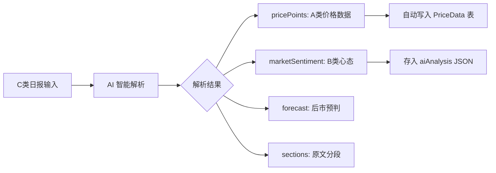

# 智能采集数据存储增强 - Walkthrough

> **完成日期**: 2026-01-19
> **核心改动**: 支持 C 类日报自动解析并提取 A 类价格数据和 B 类市场心态

---

## 📋 变更概览

本次更新实现了从 **C 类日报（500-1000字）** 中自动解析并提取 **A 类价格数据** 和 **B 类市场心态** 的能力，采用 **JSON 扩展方案**，无需数据库迁移。



---

## 📁 修改文件

### 1. 类型定义扩展

#### [market-intel.ts](file:///Users/mac/Progame/CTBMS/packages/types/src/modules/market-intel.ts)

新增 5 个 Zod Schema 和对应 TypeScript 类型：

| Schema | 用途 |
| :--- | :--- |
| `ExtractedPricePointSchema` | 从日报中提取的价格点 |
| `MarketSentimentSchema` | 市场心态分析结果 |
| `ForecastSchema` | 后市预判 |
| `ReportSectionSchema` | 原文分段 |
| `DailyReportMetaSchema` | 日报元信息 |

render_diffs(file:///Users/mac/Progame/CTBMS/packages/types/src/modules/market-intel.ts)

---

### 2. 后端 AI 服务增强

#### [ai.service.ts](file:///Users/mac/Progame/CTBMS/apps/api/src/modules/ai/ai.service.ts)

完全重写，新增以下核心方法：

| 方法 | 功能 |
| :--- | :--- |
| `extractPricePoints()` | 批量提取价格点，支持多种格式匹配 |
| `analyzeMarketSentiment()` | 分析市场情绪（bullish/bearish/neutral/mixed） |
| `extractForecast()` | 提取短期/中期预判及关键因素 |
| `extractSections()` | 识别日报分段结构 |
| `extractEvents()` | 提取事件动态 |
| `detectReportType()` | 自动识别日报类型 |
| `generateDailyReportSummary()` | 生成智能摘要 |

**支持的采集点**:
```
锦州港、鲅鱼圈、北良港、大连港、梅花味精、益海嘉里、中粮、象屿...
```

**支持的品种**:
```
玉米、大豆、小麦、稻谷、高粱
```

render_diffs(file:///Users/mac/Progame/CTBMS/apps/api/src/modules/ai/ai.service.ts)

---

### 3. 数据写入服务增强

#### [market-intel.service.ts](file:///Users/mac/Progame/CTBMS/apps/api/src/modules/market-intel/market-intel.service.ts)

新增 `batchCreatePriceData()` 方法，在创建情报时自动：

1. 检测 `aiAnalysis.pricePoints` 是否存在
2. 批量写入 `PriceData` 表（使用 upsert 避免重复）
3. 自动关联情报 ID

render_diffs(file:///Users/mac/Progame/CTBMS/apps/api/src/modules/market-intel/market-intel.service.ts)

---

### 4. 前端界面优化

#### [DataEntry.tsx](file:///Users/mac/Progame/CTBMS/apps/web/src/features/market-intel/components/DataEntry.tsx)

在 AI 分析结果区域新增：

| 组件 | 功能 |
| :--- | :--- |
| **价格数据列表** | 展示从日报提取的所有价格点，带涨跌标识 |
| **市场心态卡片** | 展示情绪分析（看涨/看跌/中性/分化）和分值 |
| **后市预判卡片** | 展示短期/中期预判和关键影响因素 |

render_diffs(file:///Users/mac/Progame/CTBMS/apps/web/src/features/market-intel/components/DataEntry.tsx)

---

## 🎯 使用方法

### 1. 日报采集流程

1. 访问 `/intel/entry` 页面
2. 选择 **C 类：文档与图表**
3. 粘贴日报全文（或点击「文档演示」体验示例）
4. 点击【AI 分析与校验】
5. 查看解析结果：
   - **价格数据 (A类)**: 自动提取的价格点列表
   - **市场心态 (B类)**: 看涨/看跌/中性判定
   - **后市预判**: 短期/中期展望
6. 确认后点击【确认入库】

### 2. 数据流向

```
用户粘贴日报
    ↓
POST /market-intel/analyze
    ↓
AI 解析返回 aiAnalysis {
    pricePoints: [...],
    marketSentiment: {...},
    forecast: {...}
}
    ↓
用户确认提交
    ↓
POST /market-intel
    ↓
1. 写入 MarketIntel 表
2. 自动写入 PriceData 表（批量）
```

---

## 📊 新增类型结构

### ExtractedPricePoint

```typescript
interface ExtractedPricePoint {
  location: string;           // 采集点
  price: number;              // 价格
  change: number | null;      // 涨跌幅
  unit: string;               // 单位（默认 元/吨）
  commodity?: string;         // 品种
  grade?: string;             // 等级
}
```

### MarketSentiment

```typescript
interface MarketSentiment {
  overall: 'bullish' | 'bearish' | 'neutral' | 'mixed';
  score?: number;             // -100 ~ 100
  traders?: string;           // 贸易商心态
  processors?: string;        // 加工企业心态
  farmers?: string;           // 农户/基层心态
  summary?: string;           // 心态概述
}
```

### Forecast

```typescript
interface Forecast {
  shortTerm?: string;         // 短期预判
  mediumTerm?: string;        // 中期预判
  longTerm?: string;          // 长期预判
  keyFactors?: string[];      // 关键影响因素
  riskLevel?: 'low' | 'medium' | 'high';
}
```

---

## ✅ 验证结果

| 项目 | 状态 |
| :--- | :---: |
| `packages/types` 编译 | ✅ |
| `apps/api` 编译 | ✅ |
| `apps/web` 编译 | ✅ |

---

## 🔮 后续迭代建议

1. **集成真实 AI API**
   - 配置 `GEMINI_API_KEY` 启用 Gemini 驱动的智能解析
   
2. **价格数据手动编辑**
   - 允许用户在提交前修改/删除错误的价格点
   
3. **企业自动关联**
   - 从日报中识别的企业名称自动关联到 `Enterprise` 表

4. **历史日报批量导入**
   - 支持 Excel/CSV 批量导入历史数据

---

*Walkthrough 生成时间: 2026-01-19*
