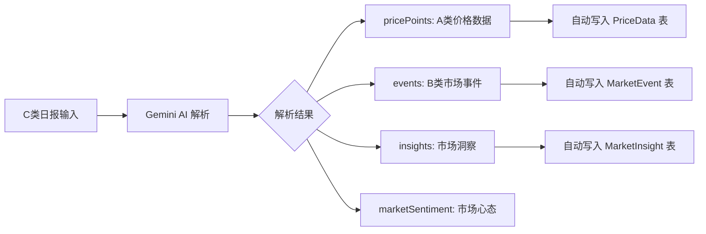

# 智能采集数据存储增强 - Walkthrough

> **完成日期**: 2026-01-19
> **最后更新**: 2026-01-22
> **核心改动**: 支持 C 类日报自动解析并提取 A 类价格数据和 B 类市场心态

---

## 📋 变更概览

本次更新实现了从 **C 类日报（500-1000字）** 中自动解析并提取 **A 类价格数据**、**B 类市场事件** 和 **市场洞察** 的完整能力。



---

## 🔧 核心实现

### 1. Gemini API 集成 (2026-01-22)

#### 环境配置

```env
GEMINI_API_KEY="your-api-key"
GEMINI_API_URL="https://your-proxy-url/gemini"
GEMINI_MODEL_ID="gemini-2.5-flash"
```

#### AI 服务方法

| 方法 | 功能 |
| :--- | :--- |
| `callGeminiAPI()` | HTTP 调用中转 API（原生 fetch） |
| `buildSystemPrompt()` | 按类别构建系统提示词 |
| `buildUserPrompt()` | 按类别提供具体指导 |
| `enhanceWithAIResponse()` | AI 结果与本地解析合并 |
| `mapSourceType()` | 智能推断价格主体类型 |
| `mapSubType()` | 智能推断价格子类型 |
| `mapGeoLevel()` | 智能推断地理层级 |

---

### 2. 价格数据分类 (A类增强)

#### 三维分类体系

| 维度 | 枚举值 | 说明 |
| :--- | :--- | :--- |
| **主体类型** | ENTERPRISE / REGIONAL / PORT | 谁的价格 |
| **子类型** | LISTED / TRANSACTION / ARRIVAL / FOB / STATION_ORIGIN / STATION_DEST / PURCHASE / WHOLESALE | 什么性质 |
| **地理层级** | COUNTRY / REGION / PROVINCE / CITY / DISTRICT / PORT / STATION / ENTERPRISE | 地理粒度 |

#### 采集点关联

- 自动匹配系统中的采集点配置（`CollectionPoint`）
- 支持别名匹配和模糊匹配
- 关联行政区划代码（`regionCode`）

---

### 3. 市场事件提取 (B类增强)

#### MarketEvent 数据结构

| 字段 | 说明 |
| :--- | :--- |
| `subject` | 事件主体（企业/港口） |
| `action` | 动作（开始收购/停机检修等） |
| `content` | 完整描述 |
| `impact` | 影响描述 |
| `impactLevel` | HIGH / MEDIUM / LOW |
| `sentiment` | bullish / bearish / neutral |
| `sourceText` | 原文片段（溯源） |

---

### 4. 市场洞察提取 (新增)

#### MarketInsight 数据结构

| 字段 | 说明 |
| :--- | :--- |
| `title` | 洞察标题 |
| `content` | 详细内容 |
| `direction` | up / down / stable |
| `timeframe` | short / medium / long |
| `confidence` | 0-100 置信度 |
| `factors` | 关键因素列表 |
| `sourceText` | 原文片段（溯源） |

---

### 5. 市场心态分析

#### MarketSentiment 结构

| 字段 | 说明 |
| :--- | :--- |
| `overall` | bullish / bearish / neutral / mixed |
| `score` | -100 ~ 100 |
| `traders` | 贸易商心态 |
| `processors` | 加工企业心态 |
| `farmers` | 农户/基层心态 |
| `summary` | 心态概述 |

---

## 📁 修改文件

### 后端

| 文件 | 变更 |
| :--- | :--- |
| [ai.service.ts](file:///Users/mac/Progame/CTBMS/apps/api/src/modules/ai/ai.service.ts) | 集成 Gemini API、优化提示词、智能映射方法 |
| [market-intel.service.ts](file:///Users/mac/Progame/CTBMS/apps/api/src/modules/market-intel/market-intel.service.ts) | `batchCreateEvents()`、`batchCreateInsights()` |
| [price-data.service.ts](file:///Users/mac/Progame/CTBMS/apps/api/src/modules/market-intel/price-data.service.ts) | 价格数据服务 *(2026-01-22 补充)* |
| [research-report.service.ts](file:///Users/mac/Progame/CTBMS/apps/api/src/modules/market-intel/research-report.service.ts) | 研报服务 *(2026-01-22 补充)* |
| [document-parser.service.ts](file:///Users/mac/Progame/CTBMS/apps/api/src/modules/market-intel/document-parser.service.ts) | 文档解析服务 *(2026-01-22 补充)* |
| [schema.prisma](file:///Users/mac/Progame/CTBMS/apps/api/prisma/schema.prisma) | MarketEvent、MarketInsight 模型 |

### 类型定义

| 文件 | 变更 |
| :--- | :--- |
| [market-intel.ts](file:///Users/mac/Progame/CTBMS/packages/types/src/modules/market-intel.ts) | ExtractedPricePointSchema、MarketSentimentSchema、ForecastSchema |

---

## 🎯 使用方法

### 日报采集流程

1. 访问 `/intel/entry` 页面
2. 选择 **C 类：文档与图表**
3. 粘贴日报全文
4. 点击【AI 分析与校验】
5. 查看解析结果：
   - **价格数据 (A类)**: 按主体类型分组展示
   - **市场事件 (B类)**: 事件列表
   - **市场洞察**: 预判分析
   - **市场心态**: 情绪判定
6. 确认后点击【确认入库】

### 数据流向

```
用户粘贴日报
    ↓
POST /market-intel/analyze (Gemini API)
    ↓
AI 解析返回 {
    pricePoints: [...],
    events: [...],
    insights: [...],
    marketSentiment: {...}
}
    ↓
用户确认提交
    ↓
POST /market-intel
    ↓
1. 写入 MarketIntel 表
2. 自动写入 PriceData 表（关联采集点）
3. 自动写入 MarketEvent 表
4. 自动写入 MarketInsight 表
```

---

## ✅ 验证结果

| 项目 | 状态 |
| :--- | :---: |
| Gemini API 集成 | ✅ |
| TypeScript 编译 | ✅ |
| 价格分类存储 | ✅ |
| 事件/洞察提取 | ✅ |

---

## 🔮 后续迭代建议

1. ~~**集成真实 AI API**~~ ✅ **已完成 (2026-01-22)**

2. **价格数据手动编辑**
   - 允许用户在提交前修改/删除错误的价格点
   
3. **企业自动关联**
   - 从日报中识别的企业名称自动关联到 `Enterprise` 表

4. **历史日报批量导入**
   - 支持 Excel/CSV 批量导入历史数据

---

*Walkthrough 生成时间: 2026-01-19*
*最后更新: 2026-01-22*
